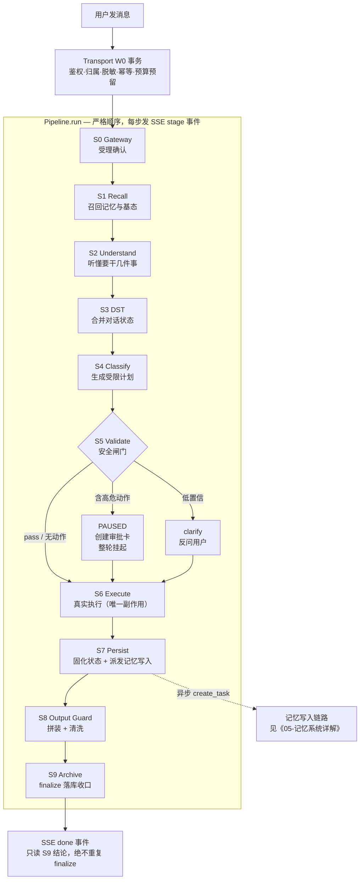
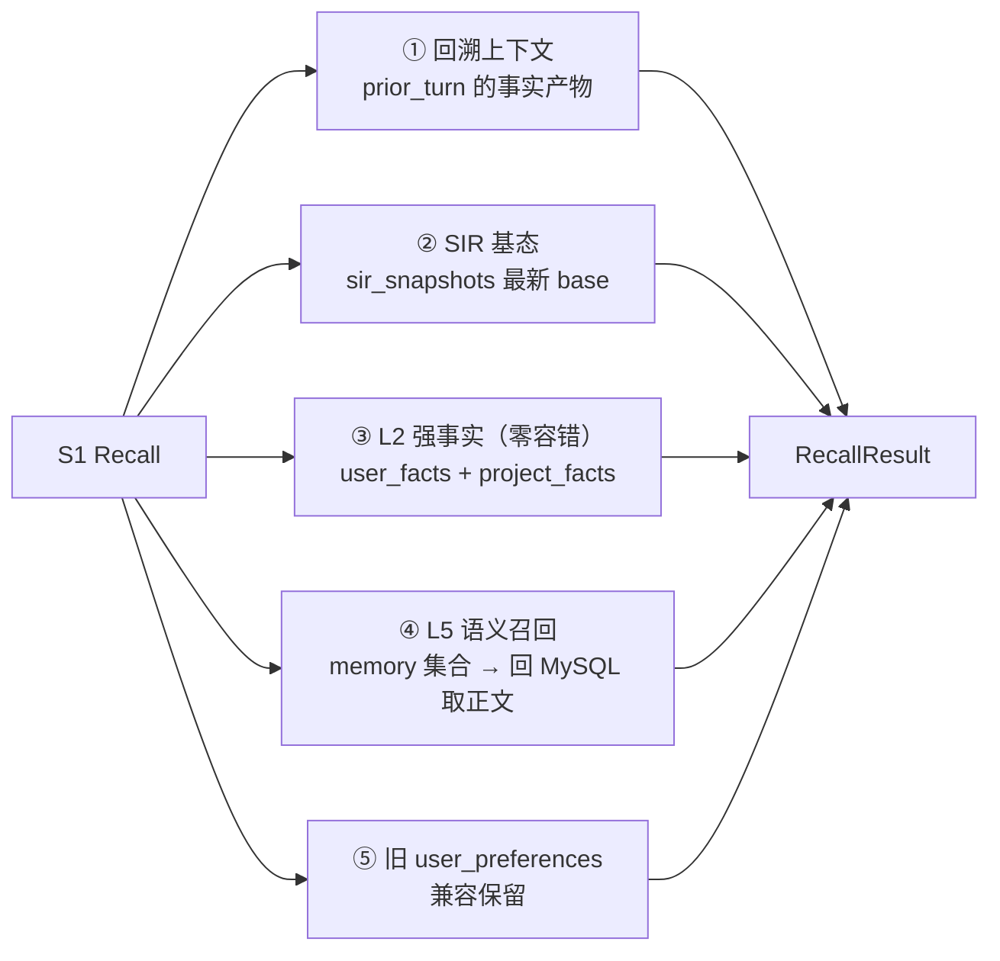
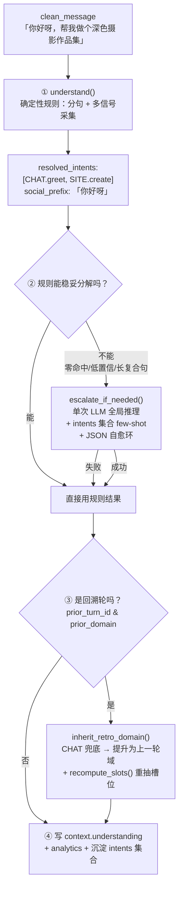
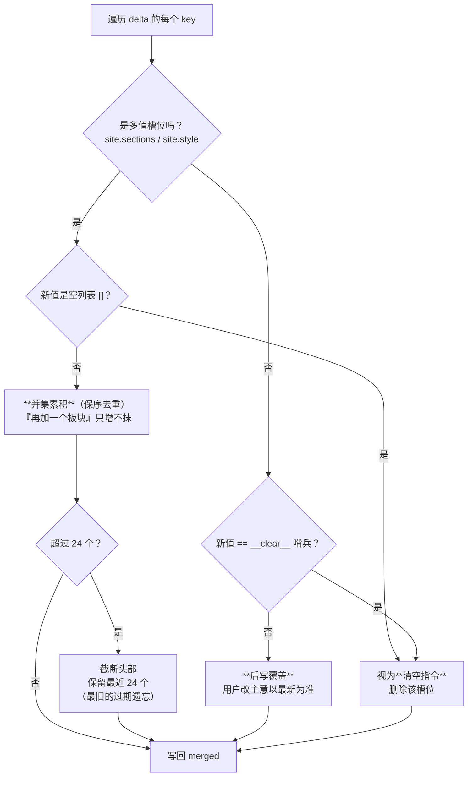
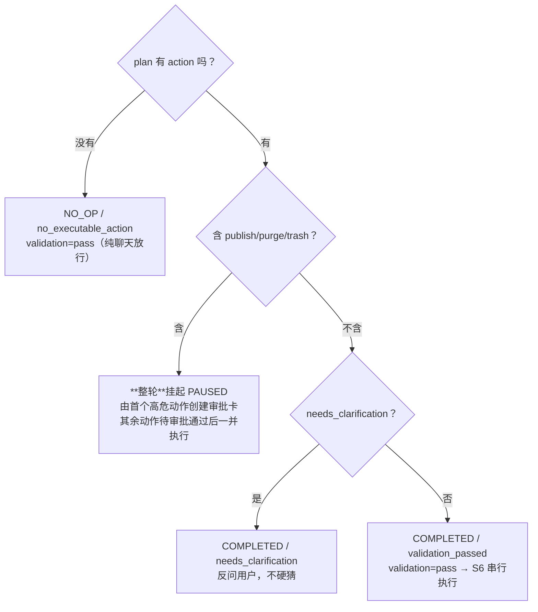
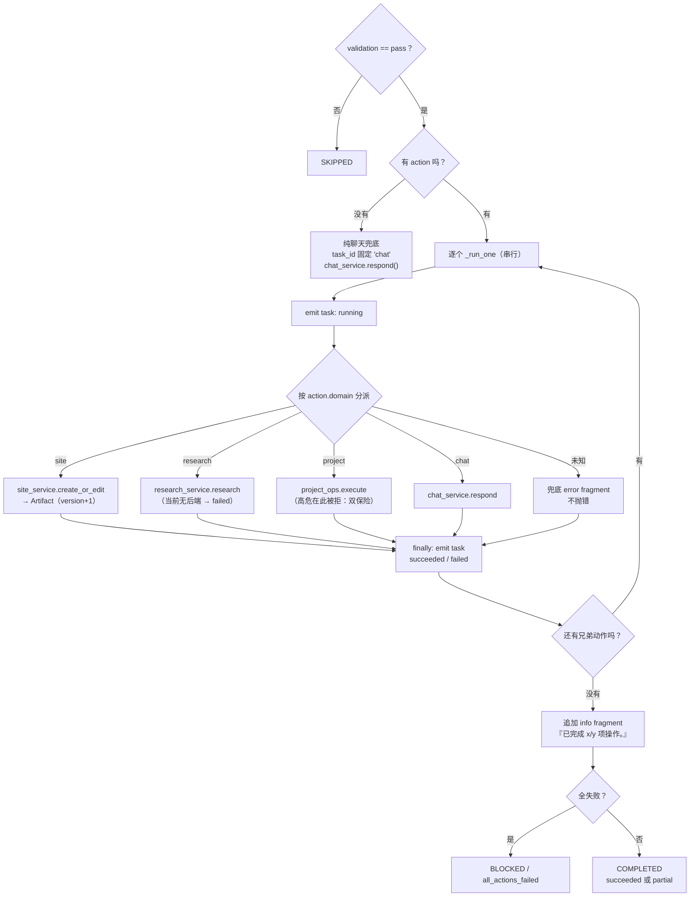
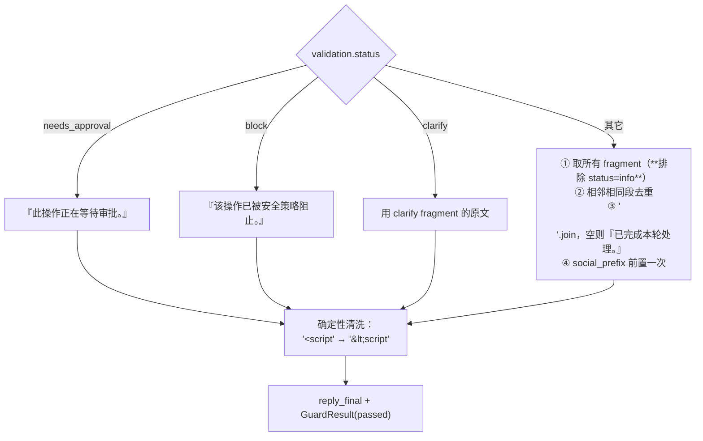

# AI 核心端细节（S0~S9 流水线全解）

> 本文档是 **AI 核心子系统的权威细节来源**，讲清楚「用户敲一句话，到屏幕上出现回复」之间，代码到底一步步干了什么。
>
> - 想了解**记忆是怎么记住、怎么想起来的** → 看《05-记忆系统详解》（本文只讲记忆在 S1/S7 的挂载点）。
> - 跨服务架构 → 《01-项目总览》；前端契约 → 《02-前端细节》；鉴权/配额/SSE/数据模型 → 《03-业务端细节》。
>
> 自 v2.0.0 单进程合并、v2.2.0 后架构演进（M11c），原 `backend/app/agent/`（Provider/FallbackRouter、Router+Skill 级联、generate_site LangGraph、SkillRegistry、ToolRegistry、四角色编排、后置 QC 单裁判）已**整体物理删除**，替换为本文描述的 **S0~S9 十阶段流水线 + `domains` 域驱动 + `ragstore` 统一向量后端**。

---

## 0. 先用大白话讲一遍

把这套系统想象成一家**餐厅的后厨流水线**。客人（用户）喊一句「来份深色的摄影作品集，对了你们几点打烊」，后厨不是一个厨师从头做到尾，而是十个工位依次传递：

| 工位 | 餐厅类比 | 系统里叫什么 |
|---|---|---|
| S0 | 前台确认「这单我们接了」 | Gateway 受理 |
| S1 | 翻一下这桌客人的历史订单和忌口 | Recall 召回 |
| S2 | 听懂客人到底点了几样东西 | Understand 意图理解 |
| S3 | 把新点的菜并进这桌的总菜单 | DST 对话状态跟踪 |
| S4 | 写出一张**有上限**的工单 | Classify 受限计划 |
| S5 | 安全检查：涉及销毁的操作要经理签字 | Validate 校验闸门 |
| S6 | 真正开火炒菜（**唯一真实副作用**） | Execute 执行 |
| S7 | 更新这桌的状态 + 记进客户档案 | Persist 状态固化 |
| S8 | 装盘、擦边、确保没有危险异物 | Output Guard 护栏 |
| S9 | 打小票、记账、结单 | Archive 归档 |

**三条贯穿全流程的铁律**（记住这三条，看代码就不会懵）：

1. **每个工位只返回一张「工位小票」（`StageResult`），绝不掀桌（不抛裸异常）。** 出错就在自己 `run()` 里接住，返回 `FAILED`，由编排器统一收口。
2. **只有 S6 能产生真实副作用**（写业务库、生成产物、改项目状态）。其余阶段要么读，要么只改内存里的 `TurnContext`。
3. **十个工位的顺序写死了，少一个多一个都启动不了**（`Pipeline.__init__` 直接抛 `PipelineContractError`）。

---

## 1. 总体定位与硬约束

AI 核心与业务层**同进程**（`backend/app`，监听 `:7101`），是单进程后端的「大脑」部分。四条硬约束（来自 v2.0.0 总纲，持续有效）：

1. **单进程**：业务 + AI 同一 FastAPI 进程，唯一对外入口 `:7101`；不另开 AI 服务端口，无 httpx SSE 双转发。
2. **AI 核心不独立水平扩展**：当前体量不需要；如算力吃紧，整体加后端副本。
3. **向量库统一后端**：所有语义检索/写回经 `app/ragstore`（Chroma HTTP），**全部 fail-soft**，绝不因向量库不可用中断主链路。
4. **配置/模型唯一真相源**在 `backend/shared`（`config.py`/`db.py`/`models.py`），`app/config.py` 等仅 re-export 垫片。

---

## 2. 目录结构（当前代码）

```
backend/app/
  core/
    pipeline.py          # 唯一 S0~S9 生命周期编排器（严格顺序契约校验 + IO 快照日志）
    contracts.py         # StageId/StageResult/UnderstandingResult/IntentBundle/BoundedPlan/SirState...
    turn_context.py      # TurnContext（贯穿 S0~S9 的唯一状态容器）
    intent_labels.py     # 中文意图/计划标签唯一真相源（前端不再维护第二份映射）
    memory_write.py      # 记忆写入主链路（S7 异步派发，详见《05-记忆系统详解》）
    stages/
      base.py             # BaseStage：统一构造 StageResult + duration_ms
      s0_gateway.py       # 受理确认
      s1_recall.py        # 召回：SIR 基态 + 回溯上下文 + L2 强事实 + L5 语义记忆
      s2_understand.py    # 意图理解（确定性 + LLM 升级）
      s3_dst.py           # 对话状态跟踪 DST（合并）
      s4_classify.py      # 受限计划（IntentBundle + BoundedPlan）
      s5_validate.py      # 校验 / 审批闸门
      s6_execute.py       # 执行（唯一真实副作用落点）
      s7_persist_state.py # 状态固化 + 记忆写入派发
      s8_output_guard.py  # 输出护栏（确定性清洗）
      s9_archive.py       # 终态归档（finalize）
  domains/
    chat/      service.py             # 闲聊 / 问答（LLM 直出 + 跨轮上下文拼装）
    site/      service.py workflow.py # 建站 / 改站（Spec→Produce→Verify→Preview）
    research/  service.py             # 研究 / 检索（Tool 当前无后端→failed）
    project/   service.py ops.py      # 项目操作（restore / trash / publish / purge）
  llm/         client.py extract.py   # 模型客户端 + 记忆固定 Schema 提取
  ragstore/    __init__.py            # 统一向量后端（Chroma HTTP）
  router/      intent.py intent_config.json  # 确定性意图识别（词表热更新）
  prompts/     chat_system.py intent_escalation.py
  services/    turns.py finalize.py recovery.py
  api/         turns.py workspace.py preview.py ops.py admin_analytics.py byok.py
```

---

## 3. 一次对话的完整旅程

### 3.1 全景流程图



> 注意 `S5 → S6` 那几条线：即使 PAUSED / clarify，**流水线也不会中途退出**，仍会走完 S6~S9。S6 自己会因为 `validation.status != "pass"` 而 `SKIPPED`，S7 会 `NO_OP`，S8 换成专用文案。这是刻意设计——十个阶段永远全部走完，保证 S9 一定收口、SSE 一定有终态。

### 3.2 编排器做的四件事（`core/pipeline.py`）

```python
for stage in self._stages:
    await observer(StageResult(..., status=RUNNING, reason_code="enter"))  # ① 进入即发帧
    in_io  = _log_safe(context.snapshot_state())                            # ② run 前快照
    result = await stage.run(context)
    out_io = _log_safe(context.snapshot_state())                            # ② run 后快照
    changed = [k for k in ... if in_io[k] != out_io[k]]                     # ③ 字段级 diff
    self._validate_result(stage.stage_id, result)                           # ④ 契约校验
    await self._audit_sink.append(result.model_copy(update={"io_in": ..., "io_out": ...}))
```

1. **进入即发 `running` 帧**：修复了此前「阶段从 pending 直跳 completed、用户体感卡死」的问题。
   > ⚠️ **坑（已踩过）**：这条 `enter` 事件发出时**阶段还没跑**，`context.plan` 之类的东西还是空的。任何在 `observer` 里挂 stage 载荷（intents/plan）的代码，**必须加 `reason_code != "enter"` 守卫**，否则会与真实结果重复下发。
2. **IN/OUT 边界快照**：`snapshot_state()` 取原始引用，`_log_safe` 递归转 JSON 并截断（`_IO_MAX_STR=4000`、列表只留前 20 个样本）。必须在 `run` 前后各调一次，否则原地修改 Pydantic 对象会让两份快照「串味」。
3. **字段级 diff**：日志里 `changed=[...]` 直接告诉你这一阶段动了哪些字段——排错第一入口。
4. **契约校验**：`result.stage` 必须匹配；**S0/S8/S9 不得 `SKIPPED`**（已接受的 Turn 必须受理、必须有输出、必须收口）。

### 3.3 三个核心数据结构

| 结构 | 位置 | 一句话 |
|---|---|---|
| `TurnContext` | `core/turn_context.py` | 本轮的**唯一状态容器**，从 S0 传到 S9。每个字段只允许指定的 Stage 写。 |
| `StageResult` | `core/contracts.py` | 工位小票：`stage` / `status` / `reason_code` / `duration_ms` / `output_refs` / `error`。 |
| `SirState` | `core/contracts.py` | 对话状态本体：`slots`（槽位）+ `constraints`（约束）+ `pending`（待办）+ `memory_hints`。 |

`StageStatus` 六种取值，含义别搞混：

| 状态 | 含义 | 典型场景 |
|---|---|---|
| `COMPLETED` | 正常干完了活 | 绝大多数 |
| `NO_OP` | **正常，但这轮没我的事** | S5 纯聊天无动作、S3 状态无变化、S7 执行未提交 |
| `SKIPPED` | 前置条件不满足，跳过 | S6 校验没过、S1 没有数据库会话 |
| `PAUSED` | 挂起等人工 | S5 创建审批卡 |
| `BLOCKED` | 被拦住/全失败 | S6 所有动作都失败 |
| `FAILED` | 出错了 | S4 缺 understanding、S9 缺 session |

> `NO_OP` 不是失败！前端 StageRail 上它是正常灰色，不该报红。

---

## 4. S0~S9 逐阶段详解

以下每个阶段统一按 **职责 → 输入 → 输出 → 怎么工作（含例子）→ 失败与降级 → 坑** 展开。

---

### S0 Gateway：受理确认

**代码**：`stages/s0_gateway.py`（全文不到 25 行）

| 项 | 内容 |
|---|---|
| **职责** | 确认「这一轮我们接了」 |
| **输入** | `context.turn_id` |
| **输出** | `COMPLETED` / `turn_accepted`，`output_refs=[turn_id]` |

**为什么这么轻？** 因为真正的重活——鉴权、项目归属校验、敏感信息脱敏、幂等去重、配额预算预留——**全部已经在 Transport 层的 W0 事务里做完了**。等 pipeline 启动时，这些已成定局。S0 存在的意义是「在流水线里留一个明确的受理锚点」，让 SSE 有第一帧、让审计有起点。

```python
async def run(self, context):
    return self.result(StageStatus.COMPLETED, "turn_accepted", output_refs=[context.turn_id])
```

**坑**：原始用户输入**不在** `TurnContext` 里。S0 之前就已在请求局部作用域内脱敏成 `clean_message` 并释放原始引用，防止它流进后续 Prompt / 日志 / 缓存 / 审计 / SSE。`TurnContext.__post_init__` 会强制 `clean_message` 非空。

---

### S1 Recall：召回

**代码**：`stages/s1_recall.py`（约 280 行，是最"杂"的阶段）

| 项 | 内容 |
|---|---|
| **职责** | 开工前把「该知道的都想起来」 |
| **输入** | `clean_message`、`prior_turn_id`、`session.conversation_id/project_id`、`user.user_id` |
| **输出** | `sir_base` / `sir_base_snapshot_id` / `prior_domain` / `prior_artifact_id` / `prior_project_id` / `user_context` / `project_context` / `recall` |

它并行地干**五件互相独立**的事：



**① 回溯上下文**（仅当 `prior_turn_id` 非空）
按上一轮的**事实产物**定位，不是靠文本猜：

```python
artifact = SELECT * FROM artifacts WHERE trace_id = prior_turn_id ORDER BY id DESC LIMIT 1
if artifact:
    context.prior_domain     = Domain.SITE
    context.prior_artifact_id = artifact.id
    context.prior_project_id  = artifact.project_id
```
这三个字段后面被 S2 用来做**域继承**、被 S6 用来**锁定改哪个项目**。上一轮没产物就降级成普通追问。

**② SIR 基态**
- 回溯轮：取 `prior_turn` 的快照（语义 = 回滚到上一轮结束时的状态）；
- 普通轮：取本会话最新 base 快照。

**③ L2 强事实（记忆 v2）** —— 精确 SQL 查询，**不走向量**，零容错：

```python
facts = await user_fact_repo.list_for_user(session, user_id)
context.user_context.append("【强事实·用户偏好(零容错，不可被语义召回覆盖)】\n- geo/城市：深圳\n- taboo/配色：不要红色")
```

**④ L5 语义召回（记忆 v2）** —— 查 `memory` 集合拿到命中，**经 `(source_type, source_id)` 回 MySQL 取正文**，绝不把向量里的 `h.text` 当真相（向量里只有标题）。然后用软偏好做 rerank 加权排序，注入 `project_context`。

**⑤ 旧 `user_preferences` 集合**：兼容保留，重置后通常为空。

**返回值判定**（这段逻辑刚修过，值得看）：

| 情况 | status | Stage 结果 |
|---|---|---|
| 有内容 + 无降级 | `hit` | `COMPLETED` / `recall_hit` |
| 有内容 + 有降级 | `degraded`（带 refs） | `COMPLETED` / `recall_degraded_with_hits` |
| 无内容 + 有降级 | `degraded` | `COMPLETED` / `recall_degraded` |
| 啥也没有 | `empty` | `SKIPPED` / `recall_gate_no_signal` |

> 🔧 **2026-08-04 修复**：老版本是 `if degraded: return`——SIR 基态加载一失败，**连带把与它毫无关系的 L2 强事实、L5 语义召回也跳过了**。而 `context.sir_base` 本来就有默认空壳 `SirState`，不会崩下游 DST。现在改成：降级照样跑 L2/L5，只在 `recall` 上标注原因。这才符合「任何失败都不阻断主链路」。

**坑**：L5 召回有个 `if hit:` 前置门控——只有回溯上下文或 SIR 基态命中了才会去查向量。全新会话的第一轮不会触发语义召回（本来也没东西可召）。

---

### S2 Understand：意图理解

**代码**：`stages/s2_understand.py` + `router/intent.py`

| 项 | 内容 |
|---|---|
| **职责** | 听懂这句话要干**几件**什么事 |
| **输入** | `clean_message`、`prior_turn_id`、`prior_domain` |
| **输出** | `understanding`（含 `resolved_intents` 列表 + `sir_delta` + `slot_stack`）、`social_prefix` |

四步走：



**关键设计**：

- **分句 `_segment`**：标点直接切断，**并在连词（再/然后/之后/另外/同时…）之前切断**。「删掉旧站，再新建博客」正确拆成两段，避免后段被吞。
- **多信号采集**：全句扫描所有命中词类，每段产出一个候选意图（**不再是 `if/elif` first-match 就 return**）。
- **CHAT 兜底桶（additive）**：无明确域的文本归 CHAT，保证「闲聊 + 建站」复合句不被整句丢弃。
- **触发词表真相源**在 `router/intent_config.json`，`reload_intent_config()` 热更新，**改词不用改代码不用重启**。
- **LLM 升级仅作兜底**：带 RAG few-shot（检索 `intents` 集合对齐既有语义）+ JSON 自愈环；失败**安全降级回规则结果**，绝不抛错中断 pipeline。
- **回溯域继承**：「改成浅色风格，加个联系我板块」不含任何域触发词，规则层会落 CHAT 兜底 → 这里提升为上一轮域（SITE），走受控 edit（version+1），而不是被降级成闲聊追问。
  > 域继承后**必须** `recompute_slots()` 重新抽槽位——因为 `understand()` 跑在提升之前，对「无域触发词」的回溯轮会把 `theme`/`sections` 槽位整批丢弃，导致 S3 合并出零变更（不落快照、不改 spec）。

**通俗例子**：

| 用户说 | 解析出的意图 | 说明 |
|---|---|---|
| 「今天几号」 | `[CHAT.ask]` | 纯闲聊，S5 会 NO_OP 放行 |
| 「帮我做个深色摄影作品集」 | `[SITE.create]` | 槽位 `site.theme=深色`、`site.type=摄影作品集` |
| 「你好呀，顺便做个博客」 | `[CHAT.greet, SITE.create]` | 寒暄被剥离进 `social_prefix`，S8 前置一次 |
| 「改成浅色，加个联系我板块」 | 规则→`[CHAT]` → 继承→`[SITE.edit]` | 回溯域继承救回来 |
| 「删掉旧站，再新建博客」 | `[PROJECT.trash, SITE.create]` | 连词前切断，两段都保住 |

**坑**：`social_prefix` 由 S2 剥离收集，S8 **只前置一次**。这是为了避免复合句里每条 chat 动作都重复寒暄。

---

### S3 DST：对话状态跟踪

**代码**：`stages/s3_dst.py`

| 项 | 内容 |
|---|---|
| **职责** | 把「本轮新说的」并进「这个会话一直以来的状态」 |
| **输入** | `sir_base`（左）+ `understanding.sir_delta`（右） |
| **输出** | `sir_after_dst`、`sir_diff`、`sir_after_dst_snapshot_id` |

**这是整个系统最容易理解错的地方，先把三个操作数讲清楚**：

| 名字 | 是什么 | 谁产生的 |
|---|---|---|
| `sir_base` | 会话级**跨轮持久基态** | S1 从 `sir_snapshots` 取最新 base 快照 |
| `sir_delta` | 本轮从用户话语**确定性抽取**的增量 | S2 的 `_extract_slots`（零 LLM 成本） |
| `sir_after_dst` | 合并结果，**下游唯一真相** | S3 |

**合并策略按槽位语义分流**，不是无脑 dict 覆盖：



- **单值槽位**（`site.theme`/`site.type`）：后写覆盖。
- **多值槽位**（`site.sections`/`site.style`）：并集累积；**显式给 `[]` 才算清空**（与「本轮没提到」严格区分，否则永远删不掉已沉淀的板块）；上限 `_UNION_SLOT_CAP = 24`，超出丢最旧的。
- **constraints**：按 `kind` 去重覆盖同类。（旧实现是无脑 `extend`，10 轮对话能堆出 10 条互相矛盾的 theme 约束。）
- **pending / memory_hints**：追加并截断最近 20 条。

**具体例子**（三轮建站）：

| 轮次 | 用户说 | sir_delta | 合并后 sir_after_dst.slots |
|---|---|---|---|
| 1 | 做个深色摄影作品集 | `{theme:深色, type:摄影作品集}` | `{theme:深色, type:摄影作品集}` |
| 2 | 加个联系我板块 | `{sections:[联系我]}` | `{theme:深色, type:摄影作品集, sections:[联系我]}` |
| 3 | 改成浅色，再加个关于我 | `{theme:浅色, sections:[关于我]}` | `{theme:**浅色**, type:摄影作品集, sections:[联系我, **关于我**]}` |

看第 3 轮：`theme` 被**覆盖**（深色→浅色），`sections` 是**并集**（联系我 + 关于我）。这就是「按语义分流」的价值。

**可追溯性**：每次合并产出结构化 `sir_diff`，同时落到三处：
1. `sir_snapshots` 表（`kind=base`，带 `prev_snapshot_id` 形成**快照链**，可回放）；
2. `StageResult.output_refs`（SSE 透出，形如 `+site.sections` / `~site.theme` / `-site.style`）；
3. 一条 INFO 日志，含 `added/updated/removed/unchanged`，且 `updated` 打印完整的 `from -> to`。

**落库闸门**：只有 `changed`（有 added/updated/removed）才 `sir_repo.insert` 写新快照，否则 `NO_OP` 不刷快照——避免纯闲聊轮刷出大量同内容快照。

**顺带做的事**：把 `slot_stack` 里 `dyn_` 前缀的 L3 动态业务槽（会员/积分/预约…）用 `persist_dynamic_slot` 沉淀为用户持久偏好，确定性 doc id `dynpref:{user_id}:{key}` 保证同 key 自动更新。失败不中断主链路。

> ⚠️ **有意的设计取舍**：SIR **不会**因为「算了不建站了」这种否定句清空 `site.*`。对话状态是「会话级、按槽位键累积」的稳健语义，旧建站基态保留在 base 被下轮读回是**预期行为**（避免误触清空丢失已收集信息）。不要去加否定哨兵分支。

---

### S4 Classify：受限计划

**代码**：`stages/s4_classify.py`（不到 30 行，重活在 `router/intent.classify`）

| 项 | 内容 |
|---|---|
| **职责** | 把意图翻译成一张**有硬上限**的工单 |
| **输入** | `understanding`、`prior_turn_id` |
| **输出** | `intent_bundle`、`plan`（`BoundedPlan`） |

```python
if context.understanding is None:
    return self.result(StageStatus.FAILED, "understanding_required")   # 前置依赖缺失
context.intent_bundle, context.plan = classify(clean_message, understanding, prior_turn_id)
```

**为什么叫「受限」计划？** 因为 action 数量有**双层上限**：

| 层 | 常量 | 作用 |
|---|---|---|
| 运行期 | `settings.max_action_items`（默认 5，可配置） | 日常调节 |
| 数据模型 | `contracts.MAX_ACTION_ITEMS` | 硬护栏，配置写错也兜得住 |

计划是**串行**的（`BoundedPlan.serial=True`）。`has_gated` / `max_risk` 两个字段供 S5 决策、S9 统计。

每个 `ActionItem` 带 `id`（前端子任务行的锚点）、`intent_id`、`domain`、`speech_act`、`target`、`arguments`、`prior_turn_id`。

> `ActionItem.id` 与 SSE `task` 事件的 `task_id` **同源**，前端靠它把子任务状态回填到正确的行。纯聊天场景固定用 `"chat"`。

---

### S5 Validate：校验 / 审批闸门

**代码**：`stages/s5_validate.py`

| 项 | 内容 |
|---|---|
| **职责** | **最高危阶段**——决定这轮能不能真的动手 |
| **输入** | `plan.action_items`、`intent_bundle.needs_clarification` |
| **输出** | `validation`（`ValidationResult`），可能追加审批/澄清 fragment |

四条分支，按顺序判：



**为什么高危要「整轮」挂起，而不是只挂高危那一条？**
避免**半执行错盘**——如果只拦高危、放行低危，会出现「低危动作已经落库了，高危动作却被网关拦下」的撕裂状态。所以只要计划里有任意一个高危动作，整轮全挂起，并明确提示「其余动作将在审批通过后立即执行」。

**高危动作的真实执行不在 S6**，而在审批决策端点 `decide_approval` 内。这样同一个副作用只有一条执行路径。S6 里那段 `_GATED_PROJECT_ACTIONS` 判断是**双保险**：正常永远走不到，走到了说明闸门被绕过，必须拒绝而不是执行。

**风险分级**：`publish`/`purge` → `critical`；`trash` → `high`；其余 → `low`。

---

### S6 Execute：执行

**代码**：`stages/s6_execute.py`（约 265 行）

| 项 | 内容 |
|---|---|
| **职责** | **唯一真实副作用落点** |
| **前置** | `validation.status == "pass"`，否则 `SKIPPED / validation_not_pass` |
| **输出** | `response_fragments`（每个动作一段）、`execution`（`ExecutionResult`） |



**三个关键设计**：

1. **单动作失败不中断兄弟动作**。`_run_one` 用 `try/except` 兜住，落一条 error fragment（"执行「XXX」时出现问题，其它动作不受影响。"）后返回 `False`，循环继续。这闭合了「复合句里一个动作炸了整轮崩」的漏盘分支。

2. **`finally` 收口发 task 事件**。异常路径也能把行状态从 `running` 落到 `failed`，否则前端计划列表会有一行**永远转圈**。
   > 📌 **历史缺陷**：契约里 `StreamEvent.type` 早就有 `"task"`，但 S6 此前**从未 emit 过**，导致前端子任务状态/activities 恒空、列表看起来是死的。现已每条 action 必发 `running → succeeded/failed`。

3. **回溯锁定**：`context.prior_project_id` 非空时，site 域强制以该 project 为目标做 version+1 受控 edit，**不另起新站**。

**`ExecutionResult.status` 三态**：全成功 `succeeded` / 部分成功 `partial` / 全失败 `failed`（并 `committed=False`）。

**坑**：那条 `已完成 x/y 项操作。` 是 `status="info"` 的 fragment，**S8 会把 info 过滤掉不进正文**，只作内部 trace。别奇怪为什么用户看不到它。

---

### S7 Persist：状态固化 + 记忆写入派发

**代码**：`stages/s7_persist_state.py`（约 60 行）

| 项 | 内容 |
|---|---|
| **职责** | 把 DST 结果定为最终态 + **派发**记忆写入 |
| **输入** | `sir_after_dst`、`validation`、`clean_message`、`reply_final`/`response_fragments` |
| **输出** | `sir_final`、`memory_decision`，异步任务一枚 |

```python
context.sir_final = context.sir_after_dst
if context.validation is not None and context.validation.status != "pass":
    context.memory_decision = MemoryDecision(status="skipped", reason_codes=["execution_not_committed"])
    return self.result(StageStatus.NO_OP, "execution_not_committed")   # 需审批/被阻止 → 不固化

self._dispatch_memory_write(context)   # asyncio.create_task(persist_and_extract(...))
context.memory_decision = MemoryDecision(status="persisted", reason_codes=["async_extraction_dispatched"])
return self.result(StageStatus.COMPLETED, "canonical_state_ready")
```

**记忆写入为什么是 `create_task` 异步？** 三个理由：
1. 它要调一次 LLM 做提取，慢；
2. 它**不在 token 流内**，绝不能让用户等；
3. 它 fail-soft，丢了下轮还能补，不值得反噬主链路。

受 `settings.memory_extraction_enabled` 总开关控制。详细的提取/分库/向量写入流程见 **《05-记忆系统详解》§4**。

> 🔄 **v2 变更**：老版本 S7 里的 `_persist_vector_context` 会**把用户原文直接塞进向量库**。现已删除——现在向量里只存标题，正文一律在 MySQL。原因见《05》§2。

---

### S8 Output Guard：输出护栏

**代码**：`stages/s8_output_guard.py`

| 项 | 内容 |
|---|---|
| **职责** | 把碎片拼成一段话，并确保没有危险内容 |
| **输入** | `response_fragments`、`validation`、`social_prefix` |
| **输出** | `reply_draft`、`reply_final`、`guard_result` |



**两个防御点**：
- **相邻相同段去重**：防止上游某环节对纯 chat 重复 append 了相同 fragment（如兜底分支与 `_run_chat` 同轮各写一次），导致落库正文「同一段说两遍」。按相邻去重，不丢内容顺序。
- **`<script` 转义**：规范要求「模型/provider 原始生成文本不得直抵此层」，这是最后一道确定性兜底。

---

### S9 Archive：终态归档

**代码**：`stages/s9_archive.py`

| 项 | 内容 |
|---|---|
| **职责** | 落库收口，**终态的唯一写入点** |
| **输入** | 整个 `context` |
| **输出** | `archive_result` |

```python
status = await finalize_service.finalize(self.session, context)
context.archive_result = ArchiveResult(
    status="finalized" if status in {"completed", "blocked"} else "attempt_archived")
```

`finalize` 负责把 assistant 消息、Turn 终态、用量统计一次性落库。

> 🚨 **绝对不要重复 finalize**。SSE 的 `done` 事件**只读 S9 的结论**。若 `done` 再调一次 finalize，同事务二次 `add` 会撞消息唯一约束，导致**整个 Turn 回滚**。这个坑踩过一次，代价是整轮数据丢失。

---

## 5. 意图识别（确定性优先 + 分句 + LLM 升级）

入口 `app/router/intent.py`，**确定性优先、LLM 仅作兜底**。核心机制在 §4 的 S2 已详述，这里补充几个实现细节：

- **词表真相源**：`router/intent_config.json`，`reload_intent_config()` 热更新。
- **槽位抽取 `_extract_slots`**：`site.theme/type/style/sections/brief` 确定性抽取，零 LLM 成本。
  - 仅建站（CREATE）填 `brief`——避免回溯改站时把「改成浅色」当成站点简介覆盖掉。
  - 无 site 域意图时**直接丢弃 `site.*`**（纯闲聊轮的 delta 近似为空）。
- **随生产补充**：已确认的**可执行**意图示例后台 upsert 进 `intents` 集合（幂等，纯 CHAT 不写），让知识库随生产持续丰富。

> ⚠️ **已知设计局限**：一句话含多意图**会**被分句拆开，但如果规则和 LLM 都无法稳妥分解，最终仍可能落成单一意图。真要做更强的多意图编排需中量重构。

### 5.1 同域单任务收束（2026-08-06，在途）
`understand()` 在计算 primary 前调用 `_merge_redundant_site_intents(message, resolved)`，把「一个建站任务被规则误拆」收敛回单意图：
- **内容从句收束**：存在可执行 `SITE` 意图时，命中 `CONTENT_VERBS`（介绍/展示/呈现/能力/作品/功能/板块…）的 `CHAT` 兜底从句并入首个建站意图的 `message/raw_segment`（如「…介绍一下个人前端能力」本意是站点内容，不是独立闲聊）。
- **冗余建站收束**：同轮 ≥2 个「可执行 SITE + 同 speech + 未引入不同 site_type」（如首段 `site_create` + 末段因「网站」切出的 `site_create`）合并入首个。
- 保真：不同 speech（删旧建新）、不同 type（博客再商城）、不命中内容动词的 genuine 闲聊仍多意图。`CONTENT_VERBS` 在 `intent_config.json`，热更新。

### 5.2 LLM 升级守卫（2026-08-06，在途）
`escalate_if_needed()` 触发条件简化为并列 OR（**无 `has_confident_executable` 提前 return**）：
- `is_long = len(message) > 24` —— 够长即升级；
- `many = n > 2` —— 收束后仍 >2 意图即升级；
- `multi_low = n > 1 and 低置信(<0.85)`。
纯闲聊护栏（`全 CHAT 兜底`）仍最前兜底，避免长闲聊被误升级。任何 LLM 失败安全降级回规则结果。

---

## 6. 域服务（domains）

S6 按 `action.domain` 分派。

### 6.1 chat（闲聊 / 问答）

`chat_service.respond(context)` → 调 `app/llm/client.py` 直接回复。

**跨轮上下文怎么来的**（这块常被误解，展开讲）：

```
system prompt = serialize_for_llm([
    (100, L1 系统人设),
    ( 85, L2 强事实段    ← S1 从 user_facts/project_facts 精确取),
    ( 80, L4 本回合意图),
    ( 30, L5 语义召回段  ← S1 从 memory 集合召回后回 MySQL 取的正文),
])
messages = [system] + L3 最近 5 条 user/assistant 真实历史 + [当前 user]
```

- **L3 短期记忆是直接查 `messages` 表**取本会话最近 5 条 user+assistant 交替拼进窗口的，**不是**靠向量召回。
- `serialize_for_llm` 会在超预算时**从低优先级往高裁**（L5 → L3），**L1/L2/L4 永不被牺牲**。详见《05》§6。

### 6.2 site（建站 / 改站）

`SiteService.create_or_edit(session, context)` → `site_workflow` 四步：

```
build_spec  →  produce  →  verify  →  preview
   ↓             ↓          ↓          ↓
合并 SIR 槽位   LLM 生成    静态校验    落不可变 Artifact
+ requirement  单文件 HTML  确定性错误   version 线性递增
_doc                       仅定向修复一次
                           反复失败沉淀 error_patterns
```

- **回溯锁定**：`prior_project_id` 非空 → 强制以该 project 为目标做 version+1 受控 edit。
- **写回知识库**（后台，fail-soft）：`components` / `project_memory` / `project_code` / `user_preferences`，id 含维度 + 内容 hash，幂等不阻塞响应。

### 6.3 research（研究 / 检索）

`research_service.research(context)` → `tools/research.py`。**当前环境无搜索/联网后端**，Tool 契约明确返回 `failed`——绝不静默成功或伪造结果。

### 6.4 project（项目操作）

- 低危（`restore`）：S6 直落 `project_ops.execute`。
- 高危（`publish`/`trash`/`purge`）：S5 创建审批卡，**真实执行在 `decide_approval` 端点**。

---

## 7. 统一向量后端 ragstore

`app/ragstore/__init__.py` 是向量库唯一读写后端。

**设计约束**：
- **全部 fail-soft**：Chroma 不可达 / 集合不存在 / 依赖缺失 → 读返回 `[]`、写静默跳过并留日志，**绝不抛异常中断主链路**。
- **读写分离**：读在 stage 内同步 `await`；写一律走 `safe_upsert_bg` 后台任务。
- **集合名真相源在 `settings`**，本模块只做传输。

**嵌入函数（这里有坑，必读）**：
- Qwen `text-embedding-v3`，**维度固定 1024**。
- `name()` 必须返回 `"default"`，匹配既有集合持久化配置，规避 chromadb embedding function conflict。
- chromadb 1.5.9 在 query 路径以 **list** 调 `embed_query`，`embed_documents` / `embed_query` **两个方法都必须返回 2D `(N,1024)` numpy 数组**（内部会 `.tolist()`，返回 Python list 会报 `'float' object has no attribute 'tolist'`）。
- Qwen **单次 batch ≤ 10 条**，`_embed` 必须分块。

**集合语义**（与重置脚本对齐）：

| 类别 | 集合 | 重置行为 |
|---|---|---|
| 知识底座 PRESERVED | `intents` / `components` / `error_patterns` / `kb_design` / `rag_corpus` | **保留** |
| 项目隔离 RUNTIME | `project_memory` / `project_code` / `conversation_context` / `user_preferences` / `memory` | **清空** |

**接口**：`retrieve` / `upsert` / `safe_upsert_bg` / `count` / `format_hits_for_prompt`（稳定 id 幂等去重）。

**随生产补充全链路**：S1 召回读 → S2 升级读 `intents` few-shot → S7 记忆写入写 `memory` → 建站成功写 `components`/`project_memory`/`project_code`/`user_preferences`，校验失败沉淀 `error_patterns`。

---

## 8. SSE 事件（前端协议）

| 事件 | 时机 | 载荷要点 |
|---|---|---|
| `stage` | 每阶段进入（`reason_code="enter"`）+ 结束 | `status` / `reason_code` / `duration_ms` / `output_refs`（S3 含 `+slot`/`~slot`/`-slot` DST 轨迹） |
| `intent` | S2 后 | 解析出的意图列表 |
| `task` | S6 每个 action | `task_id`（与 `ActionItem.id` 同源）/ `label` / `status` / `duration_ms` |
| `token` / `think` | LLM 流式产出 | 节流间隔唯一来源 `domains/chat/service.py::_EMIT_INTERVAL_S`（当前 0.2s） |
| `preview` | 建站产物就绪 | COS 直链或 srcdoc 兜底 |
| `paused` / `confirm` / `clarify` | S5 | 审批卡 / 澄清 |
| `done` | S9 后 | 携带 `reply_final`，**只读 S9 结论** |
| `error` | 异常 | — |

> **中文标签唯一真相源**是 `core/intent_labels.py`（`intent_label` / `intent_payload` / `plan_item_payload`）。前端**不**维护第二份映射——新增意图组合只改这一处。

---

## 9. 排错指南：想看什么，去哪看

> 控制台已配置**全量打印、不截断**（`logging_config.py` 控制台 + `backend/app/logs/<svc>.log` 按日滚动双写，默认 INFO）。

| 我想知道… | 去看 | 日志标记 |
|---|---|---|
| **LLM 到底喂了什么 / 回了什么** | `app/llm/client.py` | `[LLM→]` 完整 prompt 全文（逐角色展开）<br/>`[LLM←]` 完整响应全文（流末打印） |
| **每个阶段的输入输出、改了哪些字段** | `app/core/pipeline.py` | `[pipeline.io] <stage> \| changed=[...] \| IN={...} \| OUT={...}` |
| **向量库到底召回了什么** | `s1_recall.py` | `[S1] 向量召回(记忆) source=... dist=... 正文(回MySQL): ...` |
| **SIR 基态里有什么** | `s1_recall.py` | `[S1] 加载 SIR 基态 ... slots内容=... constraints=... pending=...` |
| **DST 改了哪些槽位** | `s3_dst.py` | `[S3] DST 合并 ... added/updated（含 from -> to）/removed` |
| **计划是什么、每步干了啥** | `s6_execute.py` | `[S6] plan.action[i] id=... intent=... args=...` + 各域产物行 |
| **记忆写入结果** | `core/memory_write.py` | `[memory_write] ...`（失败也只 warn，不影响主链路） |

同一份 IN/OUT 快照还落 `trace_events` 表，供后台回放。

---

## 10. 已移除的旧架构（勿混淆）

> 以下在 **M11c 之后已从代码库物理删除**，仅存于 git 历史。新代码不要引用：

- `backend/app/agent/`：Provider/FallbackRouter、Router+Skill 级联、generate_site LangGraph、SkillRegistry（9 skills）、ToolRegistry（8 tools）、四角色 product/design/dev/qa 编排、后置 QC 单裁判。
- 旧意图体系：`cascade.py classify_v3` 混合级联、`detect_intent_v2`、SIR 双轨（`intent_slots` Redis）、`user_states` 断点续跑表（改用 `conversations.status` + `sir_snapshots`）。
- 旧 RAG（9 集合各自直连）→ 统一为 `ragstore`。
- S7 的 `_persist_vector_context`（把用户原文直接写向量）→ 由记忆 v2 链路取代。

---

## 11. 近期演进

- **2026-08-01（M11c）**：删除旧 `backend/app/agent/` 全树；意图识别简化为确定性规则优先 + LLM 升级兜底。
- **2026-08-01~02**：S0~S9 十阶段流水线落地；DST 改用 `sir_snapshots`（`prev_snapshot_id` 快照链）；回溯域继承修复「改站被降级成闲聊」。
- **2026-08-02**：向量库复活，`ragstore` 统一后端接通全链路。
- **2026-08-03**：S6 补发 `task` 事件（此前前端子任务列表恒空）；`chat.service` 改为直接查 `messages` 表拼最近 5 条真实历史（短期记忆不再依赖向量召回）。
- **2026-08-04**：全链路 IO 日志增强（`[pipeline.io]` + `[LLM→/←]` 全文）；**记忆模块 v2 落地**（MySQL 真相 + 向量索引 + Token 防爆，详见《05-记忆系统详解》）；S1 降级路径修复（不再跳过 L2/L5）；SIR 多值槽位 `_UNION_SLOT_CAP=24`；系统规则双轨子系统（MySQL 原文 + 向量摘要 + 语义召回，详见《07》）。
- **2026-08-05**：hy3 代码生成接入 `site/workflow.produce()`；建站续答死循环修复 + 主题属性安全归一；Python3.11 部署兼容。
- **2026-08-06**：模型选择器全链路（`requested_model` 透传所有域 `produce()`，`/api/models` 免登录 + Redis 缓存）；建站 token 实时流式小窗；首建站误标「修改网站」→ 改「构建网站」；S5 统一目标校验护栏（`project/guard.py` 单一真相源，覆盖 edit+review + edit 真实性兜底）；**意图收束（在途）**——`_merge_redundant_site_intents()` 合并「建站 + 内容从句 chat_ask + 冗余 site_create」为单建站意图；`escalate_if_needed` 升级守卫简化为「`is_long(len(message)>24)` 或 `many(n>2)` 或低置信多候选」任一触发（不再有 `has_confident_executable` 提前 return）。
- 更早演进见《99-版本更新记录》。
