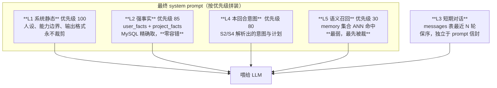
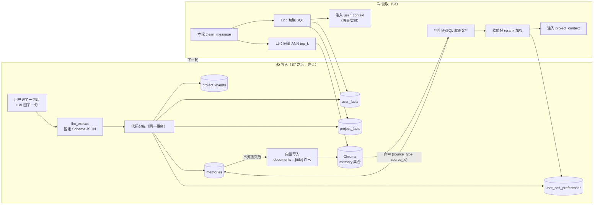
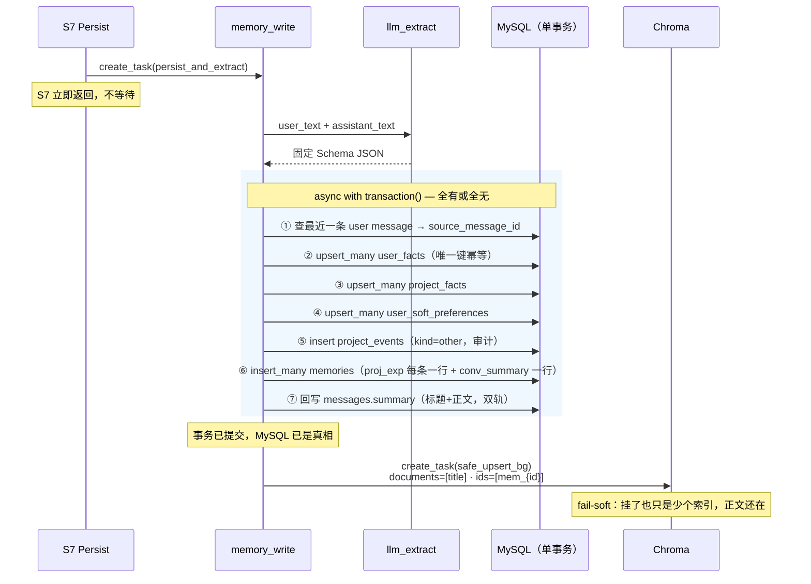
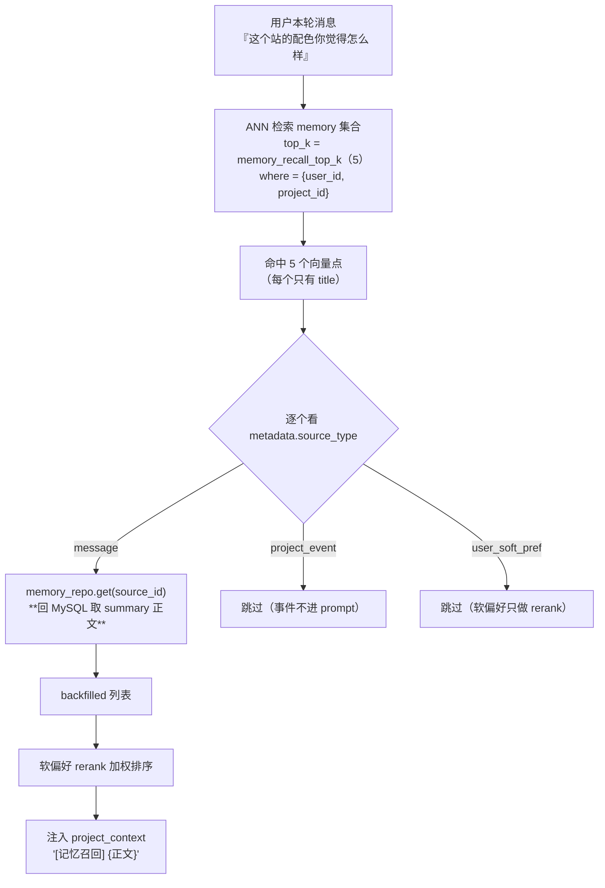
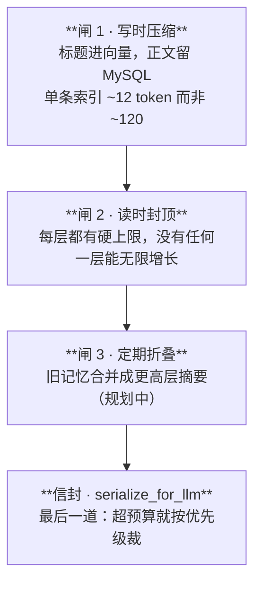
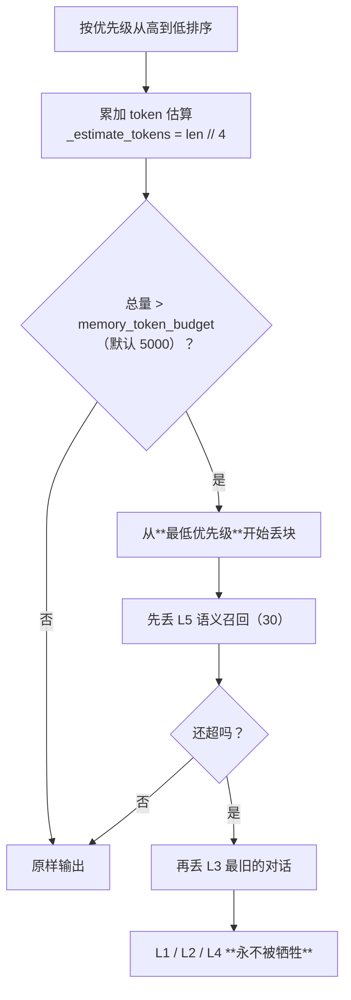

# 记忆系统详解（Memory v2：MySQL 真相 × 向量索引）

> 本文档是 **记忆子系统的权威说明**，独立成篇。讲清楚三件事：
> 1. AI 是怎么**记住**你说过的话的（写入链路）；
> 2. 下一轮它是怎么**想起来**的（读取链路）；
> 3. 记得越来越多，为什么 **token 不会爆**（防爆机制）。
>
> 落地方案与决策记录见 `docs/plan-memory-v2-landing.md`；记忆在流水线里的挂载点（S1 召回 / S7 写入）见《04-AI 核心端细节》。

---

## 0. 先用大白话讲一遍

### 0.1 没有记忆的 AI 有多蠢

```
第 1 轮  用户：我在深圳，做网站别用红色，我不喜欢。
        AI  ：好的，明白了。
第 5 轮  用户：帮我做个本地生活服务站。
        AI  ：好的！我用热情的**红色**主调，请问您在哪个城市？   ← 全忘了
```

这就是**没有长期记忆**的样子。要让它不犯这个错，得解决四个问题：

| 问题 | 通俗说法 |
|---|---|
| 记什么 | 「我在深圳」要记一辈子，「今天天气不错」记了没用 |
| 记在哪 | 记在向量库里会**找不准**，记在数据库里会**搜不到** |
| 怎么想起来 | 用户问 A，得能联想到三周前说过的相关 B |
| 记多了怎么办 | 记了 500 条，全塞进 prompt 会直接爆 token |

### 0.2 一句话核心思想

> **MySQL 是"真相"，向量库只是"目录卡"。**

拿图书馆打比方：

```
        向量库 = 目录卡片柜                MySQL = 真正的书架
   ┌────────────────────────┐       ┌──────────────────────────────┐
   │ 卡片：《深色摄影站配色方案》 │──────▶│ 全文：用户偏好深色 #1a1a1a 底， │
   │ 编号：mem_1024           │  回查 │ 强调色青蓝，禁用红色，理由是…    │
   │ （卡片上只有标题！）        │       │ （正文只在这里）                │
   └────────────────────────┘       └──────────────────────────────┘
```

- **找书**用卡片柜（向量语义搜索，能模糊匹配「摄影站用什么颜色」）；
- **读内容**必须去书架（`(source_type, source_id)` 回查 MySQL）。

**为什么不干脆把正文也存向量库？** 三个致命原因：

1. **向量库会丢**。Chroma 是 fail-soft 的旁路组件，挂了就返回空。正文存那儿等于把用户数据托付给一个允许失败的组件。
2. **改不动**。用户说「我搬到广州了」，MySQL 一条 `UPDATE` 就改完；向量库里那条旧的「我在深圳」还在，下次照样被召回。
3. **存正文 = 存了两份**，且第二份永远可能过期。

> 这正是 v1 踩过的坑：老代码 `s7` 直接把 `clean_message` 全文写进向量库，`s1` 召回后**直接用向量里的副本**，从不回 MySQL。结果就是「记忆是只读快照，永远改不掉」。

---

## 1. 五层记忆架构

人的记忆不是一锅粥，AI 也不该是。系统把记忆切成 **L1~L5 五层**，**优先级由高到低**：



| 层 | 名字 | 存哪 | 怎么取 | 会不会被裁 |
|---|---|---|---|---|
| **L1** | 系统静态 | 代码常量 `prompts/` | 直接拼 | **永不** |
| **L2** | 强事实 | MySQL `user_facts`/`project_facts` | 精确 SQL（`WHERE user_id=?`） | **永不** |
| **L3** | 短期对话 | MySQL `messages` | `ORDER BY id DESC LIMIT 5` | 超预算时**第二个**被裁 |
| **L4** | 本回合意图 | 内存 `TurnContext` | S2/S4 现算 | **永不** |
| **L5** | 语义召回 | 向量 `memory` 集合 → 回 MySQL | ANN top_k | 超预算时**第一个**被裁 |

### 为什么 L2 必须压 L5？

这是**代码级裁决**，不是靠 prompt 里写「请优先相信前面的内容」。

```
用户强事实（L2）：taboo/配色 = 不要红色           ← 精确、确定、用户亲口说的
语义召回（L5） ：「上次那个促销页用了醒目红色…」   ← 语义相似，但可能是别的项目、别人的偏好
```

如果两者矛盾，**必须 L2 赢**。实现方式是：
1. L2 的文本块**明确标注**「零容错，不可被语义召回覆盖」；
2. L2 优先级 85 > L5 优先级 30，拼装顺序在前；
3. 裁剪时 L5 先死，L2 永远不动。

---

## 2. 数据模型：五张表

全部在 `backend/app/models/memory.py`，全部带 `created_at`/`updated_at`（`TimestampMixin` 注入）。

> 🚨 **铁律**：新增 ORM 模型**必须**在 `app/models/__init__.py` 注册。否则它不进 `Base.metadata`，`reset_all`（全库 DROP + `create_all` 重建）会**静默跳过**它——表永远不会被创建，且不报任何警告。这个盲区实打实坑过一次。

### 2.1 `user_facts` — 用户强事实

**装什么**：短、硬、跨项目永久有效的 KV 事实。

| 字段 | 类型 | 说明 |
|---|---|---|
| `user_id` | FK users | 级联删除 |
| `category` | enum | `preference` / `taboo` / `permission` / `geo` |
| `key_name` | VARCHAR(64) | 如 `城市` / `配色` |
| `value` | VARCHAR(512) | 如 `深圳` / `不要红色` |
| `source` | enum | `stated`(亲口说) / `extracted`(提取) / `imported` |
| `confidence` | INT 0-100 | 默认 90 |

**唯一键** `(user_id, category, key_name)` — 这是幂等的关键：用户第二次说「我搬到广州了」，走 UPSERT 直接把 `value` 从「深圳」改成「广州」，**不会**产生两条打架的记录。

```
真实例子：
  (42, geo,        城市,   深圳,      stated, 95)
  (42, taboo,      配色,   不要红色,  stated, 99)
  (42, preference, 风格,   极简,      extracted, 80)
```

> **为什么 `value` 只给 512 字符？** 强制约束——这张表只准装**短事实**。长篇大论的经验（"上次做电商站踩了什么坑"）不属于这里，属于 `memories.summary`。字段长度就是设计意图的护栏。

### 2.2 `project_facts` — 项目强事实

同构，但绑 `project_id`，`category` 换成 `stack` / `version` / `domain` / `constraint` / `status`。

```
  (1024, stack,      前端框架, 纯静态 HTML + Tailwind CDN)
  (1024, domain,     绑定域名, photo.example.com)
  (1024, constraint, 兼容性,   必须支持 iOS Safari 14)
```

唯一键 `(project_id, category, key_name)`。

### 2.3 `project_events` — 项目过程事件

**装什么**：「发生了什么」的流水账，偏审计。建站/改版/发布/报错/调 API。

| 字段 | 说明 |
|---|---|
| `kind` | `create`/`edit`/`publish`/`error`/`api_call`/`other` |
| `detail` | LongText，事件详情 |
| `payload` | JSON，结构化附加数据 |
| `source_message_id` | FK messages，**反向溯源**用 |
| `embedding_status` | `pending`/`ready`/`failed`/`skipped` |

> ⚠️ **事件本身不进 prompt**。它太啰嗦了，全塞进去纯属浪费 token。它的价值是：① 审计追溯；② 被异步摘要成 `memories(kind=proj_summary)` 后**间接**进入 L5 召回。
> S1 召回时如果命中 `source_type=project_event` 的向量点，代码里是直接 `continue` 跳过的。

### 2.4 `user_soft_preferences` — 用户软偏好

**装什么**：场景化、模糊、不适合当硬事实断言的倾向。

```
  tag=配色, content=做科技风时偏好深色背景配青蓝强调色, weight=70
  tag=文案, content=喜欢简短有力的标题，不喜欢排比句,   weight=50
```

**关键**：软偏好 **不进 prompt**，只用来给 L5 召回结果**重排序（rerank）**。

为什么？因为「偏好深色」是个倾向不是铁律——用户这次可能就想要浅色。把它写进 prompt 当事实会让模型过度自信；用它给召回结果加权，则是「在几条差不多相关的记忆里，优先挑符合你口味的那条」。

`weight` 就是加权分值（默认 50）。

### 2.5 `memories` — 长期语义记忆（真相行）

**这是 L5 召回的落脚点**，也是唯一与向量库双向关联的表。

| 字段 | 说明 |
|---|---|
| `kind` | `preference`/`proj_exp`/`proj_summary`/`conv_summary`/`soft_pref` |
| `source_type` | `message`/`project_event`/`user_soft_pref` |
| `source_message_id` | FK messages，反向溯源 |
| **`title`** | **VARCHAR(200) — 只有它进向量库** |
| **`summary`** | **LongText — 「标题\n\n正文」，只在 MySQL** |
| `payload` | JSON |
| `embedding_status` | `pending`/`ready`/`failed` |

**标题/正文分离**是防爆的第一道闸：

```
向量库里那条  ：  "深色摄影作品集配色偏好"                    ← 约 12 token
MySQL 里那条 ：  "深色摄影作品集配色偏好\n\n用户明确要求主色
                 #1a1a1a，强调色青蓝 #4ECDC4，禁用红色系。
                 理由是作品以夜景为主，浅色背景会削弱照片对
                 比度…"                                    ← 约 120 token
```

召回 5 条，如果向量里存正文 → 直接 600 token 进 prompt。存标题 → 60 token 就能判断"要不要展开"，需要时才回查。

**双向关联**：

```
向量点 metadata.(source_type="message", source_id=1024)  ⟷  memories.id = 1024
memories.source_message_id = 88                          ⟷  messages.id = 88
```

任何一条记忆都能反查到「它是从哪句话里提取出来的」。这是 v1 完全缺失的能力（v1 的 metadata 只有 `{kind, user_id, project_id, conversation_id}`，无法回溯）。

---

## 3. 全景图：写入与读取



---

## 4. 写入链路详解

**入口**：`s7_persist_state.py::_dispatch_memory_write` → `asyncio.create_task(persist_and_extract(...))`
**主体**：`core/memory_write.py`

### 4.1 为什么是异步的

三条理由，缺一不可：

1. 它要**调一次 LLM** 做提取，慢（几百毫秒到数秒）；
2. 它**不在 token 流内**——用户已经看到回复了，不能让他等记忆入库；
3. 它 **fail-soft**——这轮丢了下轮还能补，绝不值得反噬主链路。

所以 `persist_and_extract` 是双层保险：外层 `create_task` 不阻塞，内层 `try/except` 把所有异常吞掉只记 `warning`。

### 4.2 第一步：LLM 提取（固定 Schema）

`app/llm/extract.py::llm_extract`，`temperature=0.2`，要求**只输出 JSON**：

```json
{
  "user_facts":    [{"category":"geo","key_name":"城市","value":"深圳","confidence":95}],
  "project_facts": [{"category":"stack","key_name":"前端框架","value":"纯静态 HTML"}],
  "user_prefs":    [{"tag":"配色","content":"科技风偏好深色背景","weight":70}],
  "project_exps":  [{"title":"深色摄影站配色方案","body":"主色 #1a1a1a…","payload":{}}],
  "session_summary": {"title":"确定摄影作品集视觉方向","body":"用户…","highlights":["深色","禁红"]}
}
```

**三道防御**（因为 LLM 输出不可信）：
- `_strip_fence`：剥掉 ```json 围栏；
- `_coerce`：类型强转 + 缺字段补默认；
- `_empty_extraction`：彻底解析失败就返回空结构，**绝不抛错**。

> 🔴 **红线：LLM 只负责"提取"，绝不负责"落库"**。它输出的是纯 JSON，写哪张表、怎么幂等、怎么校验，100% 由代码决定。这条线一旦破了，一次幻觉就能污染数据库。

### 4.3 第二步：代码分库（同一事务）



**几个细节值得说**：

- **多意图分存**：`project_exps` 是个**数组**，用户一句话说了三件事就落三条 `memories` 行，各自有独立 title 和向量点。不会糊成一坨。
- **`insert_many` 返回带 id 的行**，`memory_ids` 与 `memory_rows` 一一对应，向量点的 `source_id` 才能填对。
- **`messages.summary` 双轨**：本轮消息表自己也存一份摘要，方便直接按会话回看，不必每次都走 memories。

### 4.4 第三步：向量写入（只存标题）

```python
docs.append(row["title"] or "")               # ← 只有标题！
metas.append({
    "source_type": row["source_type"],        # "message"
    "source_id":   mid,                       # memories.id ← 回查的钥匙
    "user_id": user_id, "project_id": project_id,
    "conversation_id": conversation_id,
    "kind": row["kind"], "source_message_id": source_message_id,
    "embedding_status": "ready",
})
ids.append(f"mem_{mid}")                      # 稳定 id → 幂等，重跑不会重复
```

走 `safe_upsert_bg` 后台任务，**丢了不影响正确性**（只是这条记忆暂时搜不到，正文安然躺在 MySQL）。

> 📌 **软偏好目前不单独建向量点**。代码里 `soft_pref_ids` 分支是空的（`pass`）。原因：rerank 时 S1 直接读 MySQL `list_for_user` 就够了，没必要多一次向量查询。这是有意简化，不是遗漏。

---

## 5. 读取链路详解

**入口**：`s1_recall.py`

### 5.1 L2 强事实：精确取，零容错

```python
facts = await user_fact_repo.list_for_user(session, user_id)
if facts:
    lines = [f"- {f.category}/{f.key_name}：{f.value}" for f in facts]
    context.user_context.append(
        "【强事实·用户偏好(零容错，不可被语义召回覆盖)】\n" + "\n".join(lines))
```

纯 SQL，**不碰向量**。生成的段落长这样：

```
【强事实·用户偏好(零容错，不可被语义召回覆盖)】
- geo/城市：深圳
- taboo/配色：不要红色
- preference/风格：极简
```

项目强事实同理，用 `list_for_project`。

**为什么这层能"零容错"？** 因为唯一键保证了每个 `(category, key_name)` 只有一条记录——不存在"召回了 3 条互相矛盾的城市"这种事。天然封顶，天然一致。

### 5.2 L5 语义召回：ANN → 回查 → rerank



**回查那段代码是全系统最关键的三行**：

```python
if st == "message" and sid is not None:
    row = await memory_repo.get(self.session, int(sid))
    if row is not None:
        text = row.summary          # ← 正文来自 MySQL，不是 h.text
```

> 🔴 **绝不读 `h.text` 当真相**。向量里只有标题，且可能是过期副本。这是 v2 与 v1 最本质的区别。

**rerank 打分逻辑**：

```python
def _score(text):
    s = 0
    for p in soft_prefs:
        if p.tag and p.tag in text:            s += p.weight     # 标签命中
        elif p.content[:12] in text:           s += p.weight     # 内容前缀命中
    return s
backfilled.sort(key=lambda x: _score(x[0]), reverse=True)
```

举例：召回了两条记忆，用户有软偏好 `tag=配色, weight=70`。

| 召回内容 | 得分 | 排序 |
|---|---|---|
| 「深色摄影站**配色**方案…」 | 70 | 第 1 |
| 「导航栏布局调整记录…」 | 0 | 第 2 |

于是"配色"相关的那条排在前面，更可能在预算裁剪中活下来。

### 5.3 门控与降级

- **`if hit:` 门控**：只有回溯上下文或 SIR 基态命中了才做 L5 召回。全新会话第一轮不召回（也没东西可召）。
- **每一步都 `try/except`**：L2 挂了不影响 L5，L5 挂了不影响主链路，全部只记 `warning`。
- **2026-08-04 修复**：SIR 基态加载失败曾导致 `return` 提前退出，把 L2/L5 一起跳过。现已改为降级照跑。

---

## 6. Token 防爆：三道闸 + 一个信封

记忆越攒越多，如果每轮把所有记忆都塞进 prompt，几十轮后必然爆炸。系统有**四重**防线：



### 6.1 闸 2：每层的硬上限

| 层 | 上限机制 | 数量级 |
|---|---|---|
| L1 系统静态 | 代码常量，人工控制 | ~0.3k token |
| **L2 强事实** | **唯一键 `(user, category, key)` 幂等** — 同一维度永远只有一条 | 随维度数线性，实测很小 |
| L3 短期对话 | `LIMIT N`（`chat_recent_limit`，当前 5） | 固定 |
| L4 本回合意图 | 本轮现算，天然有界 | 很小 |
| L5 语义召回 | `top_k = memory_recall_top_k`（5） | 固定 |

L2 那条尤其妙：**它不需要"截断"就天然有界**。用户说 100 次「我在深圳」，表里永远只有一条。

### 6.2 信封：`serialize_for_llm`

`domains/chat/service.py`。拼 system prompt 时不是简单 `"\n".join()`，而是带优先级的信封：

```python
blocks = [
    (100, L1_系统人设),
    ( 85, L2_强事实段),
    ( 80, L4_本回合意图),
    ( 30, L5_语义召回段),
]
system = serialize_for_llm(blocks)
```



**淘汰顺序写死为 L5 → L3 → 停手**。理由很直白：
- L5 是"可能有关"的联想，丢了最多是回答不够贴心；
- L2 是"用户亲口说的铁律"，丢了会**直接说错话**（比如用了他明确禁止的红色）。

宁可忘掉三周前的相关经验，也绝不能忘掉「不要红色」。

---

## 7. 完整实例走查

跟一个用户走三轮，看记忆是怎么长出来又被用上的。

### 第 1 轮

```
用户：我在深圳。做网站千万别用红色，我不喜欢。帮我做个深色的摄影作品集。
```

**S7 之后异步发生的事**：

```
llm_extract 输出：
  user_facts:    [{geo, 城市, 深圳, 95}, {taboo, 配色, 不要红色, 99}]
  project_facts: [{stack, 前端框架, 纯静态 HTML}]
  user_prefs:    [{配色, 摄影类站点偏好深色底以突出照片, 70}]
  project_exps:  [{title:"深色摄影作品集配色方案", body:"主色 #1a1a1a…"}]
  session_summary: {title:"确定摄影站视觉方向", body:"…"}

MySQL 落库（单事务）：
  user_facts     +2 行
  project_facts  +1 行
  user_soft_prefs+1 行
  project_events +1 行（kind=other，审计）
  memories       +2 行  → id=1024 (proj_exp), id=1025 (conv_summary)
  messages.summary 回写

向量库（事务后异步）：
  memory 集合 +2 点
    mem_1024  doc="深色摄影作品集配色方案"  meta={source_type:message, source_id:1024, …}
    mem_1025  doc="确定摄影站视觉方向"      meta={source_type:message, source_id:1025, …}
```

### 第 2 轮（隔了几分钟）

```
用户：帮我把首页 banner 换个说法。
```

**S1 召回**：
- L2 精确取 → `user_context` 拿到「城市：深圳 / 配色：不要红色」；
- L5 召回 → "banner 说法" 与已有标题语义距离较远，可能只命中 1 条弱相关，回查 MySQL 拿正文；
- L3 → `messages` 表最近 5 条真实对话。

**结果**：AI 改文案时**不会**建议红色 CTA 按钮，因为 L2 在 prompt 里明明白白写着零容错的禁忌。

### 第 3 轮（三周后，新会话）

```
用户：再给我做个本地生活服务站。
```

- **L3 短期对话** = 空（新会话，`messages` 表这个 conversation 里没历史）；
- **L2 强事实** = 照常命中！`user_facts` 是**跨会话、跨项目**的用户级数据，`WHERE user_id=42` 就取到了；
- **L5** = 召回「深色摄影站配色方案」，经软偏好 rerank 排前。

**AI 的回答**：「好的，考虑到您在深圳且不喜欢红色，我用深色系配青蓝强调色…」

这就是三周前那句话产生的价值。**注意：撑起这个效果的是 L2（MySQL 精确取），不是向量召回。** 向量召回只是锦上添花的联想；真正靠得住的是那张有唯一键的 KV 表。

---

## 8. 配置项

`backend/app/config/settings.py`：

| 配置 | 默认 | 作用 |
|---|---|---|
| `memory_extraction_enabled` | `True` | 记忆提取总开关。关掉后 S7 不再派发写入（读取不受影响） |
| `memory_token_budget` | `5000` | `serialize_for_llm` 的预算信封上限 |
| `memory_recall_top_k` | `5` | L5 向量召回条数硬上限 |
| `chat_recent_limit` | `5`（复用） | L3 短期对话窗口 |
| `chroma_collection_memory` | — | `memory` 集合名（RUNTIME 类，重置会清空） |

---

## 9. 排错 FAQ

**Q1：为什么 AI 还是记不住我说的话？**
按这个顺序查：
1. `settings.memory_extraction_enabled` 是不是被关了；
2. 日志搜 `[memory_write]` — 有 warning 说明提取或落库失败了；
3. 直接查库 `SELECT * FROM user_facts WHERE user_id=?` — 有数据说明**写入正常，问题在读取**；
4. 日志搜 `[S1] L2 用户强事实 N 条` — N=0 说明读取没命中；
5. 日志搜 `[LLM→]` 看完整 prompt — 强事实段到底有没有进去。

**Q2：为什么召回的记忆牛头不对马嘴？**
向量召回是纯语义相似度，`top_k=5` **没有距离阈值**——就算全都不相关，也会返回最像的 5 条。这是已知的弱点，也正是为什么 L5 优先级只有 30、且第一个被裁。真正靠谱的记忆走 L2。

**Q3：改了用户事实，为什么旧的还在被召回？**
`user_facts` 走 UPSERT 会立刻更新，L2 一定是新的。但**向量库里的旧标题不会自动消失** —— 如果那条 `memories` 行的正文还是旧的，召回回查也是旧的。当前设计里 `memories` 是追加式的历史记录（记录"当时说了什么"），不做原地更新；权威值以 L2 为准。

**Q4：`reset_all` 之后表没了？**
检查该模型有没有在 `app/models/__init__.py` 里注册。没注册 = 不在 `Base.metadata` = `create_all` 不会建它，且**不报错**。

**Q5：向量库挂了会怎样？**
读返回 `[]`（L5 为空，其余层照常）；写静默跳过并留日志。**主链路完全不受影响** —— 这是 `ragstore` 的 fail-soft 契约。

---

## 10. 红线与设计取舍

| # | 红线 | 为什么 |
|---|---|---|
| 1 | **MySQL 是唯一真相**，向量只是索引 | 向量允许失败、无法修改、无事务 |
| 2 | **向量只存 title**，正文回查 MySQL | 防爆第一道闸；避免过期副本 |
| 3 | **LLM 只提取，不落库** | 一次幻觉不能污染数据库；落库 100% 在代码侧 |
| 4 | **L2 代码级压 L5** | 硬事实必须赢过语义联想，不能靠 prompt 求模型自觉 |
| 5 | **记忆写入不在 token 流内** | 用户不该为记忆入库等待 |
| 6 | **Token 预算封顶**，淘汰顺序 L5→L3，L1/L2/L4 不动 | 宁可忘联想，不可忘铁律 |
| 7 | **新 ORM 必须注册 `models/__init__.py`** | 否则 `reset_all` 静默盲区 |

**有意的取舍（不是 bug）**：
- 软偏好不单独建向量点 —— rerank 直接读 MySQL 更省。
- `project_events` 不进 prompt —— 太啰嗦，只作审计与二次摘要来源。
- `source_message_id` 取"本会话最近一条 user 消息" —— 高并发下理论上可能不精确，但记忆是 fail-soft 旁路，代价可接受。
- L5 无距离阈值 —— 已知弱点，靠低优先级 + 优先裁剪对冲。

---

## 11. 代码索引

| 关注点 | 文件 |
|---|---|
| 五张表 ORM | `backend/app/models/memory.py` |
| 模型注册（**铁律**） | `backend/app/models/__init__.py` |
| 仓储（幂等 upsert） | `backend/app/db/repositories/{user_facts,project_facts,user_soft_preferences,project_events,memories}.py` |
| LLM 固定 Schema 提取 | `backend/app/llm/extract.py` |
| 写入主链路 | `backend/app/core/memory_write.py` |
| 写入派发点 | `backend/app/core/stages/s7_persist_state.py` |
| 读取（L2 + L5） | `backend/app/core/stages/s1_recall.py` |
| 预算信封 + 跨轮拼装 | `backend/app/domains/chat/service.py`（`serialize_for_llm` / `build_cross_turn_context`） |
| 向量后端 | `backend/app/ragstore/__init__.py` |
| 配置 | `backend/app/config/settings.py` |
| 落地方案原文 | `docs/plan-memory-v2-landing.md` |

---

## 12. 演进记录

- **v1（已废弃）**：`s7` 把 `clean_message` 全文直写向量库；`s1` 召回后直接用向量副本，从不回 MySQL；metadata 无 `message_id`/`memory_id` 关联；优先级只靠 prompt 摆放，无代码级裁决；无强事实层。
- **v2（2026-08-04 落地，commit `0bcaaf6`）**：MySQL 真相 × 向量索引；五张新表；固定 Schema 提取；标题/正文分离；L1~L5 分层 + 代码级优先级；Token 预算信封；`(source_type, source_id)` 双向关联。
- **2026-08-03 短期记忆（方案 A，`3f15ac4`）**：`chat.service` 改为直接查 `messages` 表拼最近真实历史，短期记忆不再依赖向量召回，解决「多轮不连贯」。
- **2026-08-06 SIR v2 桥接（`c440d84`）**：`memory_hints` 在跨轮承接中桥接记忆提示，闲聊记忆上下文与建站/闲聊插队对称处理。
- **待办**：闸 3「定期折叠」（旧记忆合并成更高层摘要）尚未实现；L5 距离阈值待评估。
