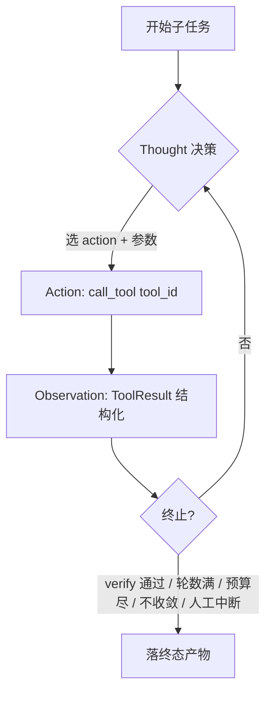

# 工具执行与子任务自主迭代（ReAct）

> 配套文档：架构总览见 `01-项目总览.md`，AI 核心端逐阶段见 `04-AI核心端细节.md`，记忆系统见 `05-记忆系统详解.md`。
> 本文聚焦两件事的**设计合集**：① 把死的 `ToolRegistry` 真正接到 S6 执行链；② 给子任务（以站点生成为例）加上 ReAct，使其能根据校验/预览结果自主多轮迭代。
> 状态：**ReAct 双计数器循环 + `_repair` 死标志修复 + 子任务上下文作用域隔离 已于 2026-08-04 落地（见 §3.9）；§2 的 `call_tool` 统一执行器与 §3 通路 B 等仍为规划。**

---

## 0. 为什么把这两块放一起

ReAct（Reason + Act + Observe）的本质是"行动 → 观察 → 再行动"的闭环。在 seedAI 里：

- **"行动"就是调一个原子 Tool**——经 `ToolRegistry` 取用；
- **"观察"就是 `ToolResult`**——结构化返回（成功/失败/未知 + `data`/`error`/`metrics`）。

所以 **`ToolRegistry` 是 ReAct 的执行底座，ReAct 是 Tool 之上的一层编排**。先把 Tool 层接活（§2），ReAct（§3）才有可消费的 action/observation。

### 两个必须先认清的现状事实

1. **Tool 层是死的**：16 个原子 Tool 在生产链路零调用；`tools/site.py` 反向 import `domains/site/workflow.py` 私有函数（依赖倒置）；`ToolContext` 从未被构造；S5 硬编码 gated、S6 硬编码 risk。
2. **站点"修一次"是空转**（调研中最重要的反直觉发现）：`service.py:55` 写入 `_repair=True`，但 `produce` 内部**从不读取**该标志。由于 `produce` 是确定性纯函数（无 LLM），第二次重放必然产出相同 HTML、以相同 reason 再次失败。代码注释宣称的"规范 §8.2 Repair 定向修复"与实际不符——**站点迭代能力当时实质为 0，不是"1 轮想扩到 N 轮"，而是从 0 建**。（**已于 2026-08-04 修复**：`produce` 现读取 `_repair_round`/`_repair_reason`，在修复轮跳过 RAG 增强并跑 `_sanitize_html`，打破确定性空转；站点 ReAct 能力从 0 建立，详见 §3.9）

---

## 1. 现状盘点（决定设计走向）

| 组件 | 现状 | 对改造的影响 |
|---|---|---|
| `produce(spec)` | 纯确定性 f-string 模板，**零 LLM**；`_repair` 标志无人读取 → no-op | ReAct 前提：必须让约束能进入 produce 并改变输出 |
| `verify(html)` | 返回 `(ok, code)`，code 是 4 类稳定枚举（`missing_doctype`/`unclosed_html`/`too_small`/`unsafe_token`）；**无 detail、短路、无位置** | 仅够做"是否再来一轮"门控，不够做"下一轮怎么改" → 需升级为问题列表 |
| `preview` | 在 verify **之后**；落不可变 Artifact（v 递增）；**无渲染、无截图** | 当前是流程终点，不能作为 ReAct 观察源；若需"看预览"须引入 dry-run 渲染 |
| 迭代上限 | `service.py` 硬编码 1 次 repair（共 ≤2 次 produce），无轮数配置 | 需改成可配置循环 |
| 模型预算 | `services/turns.py` 固定 `max_model_calls=1` | ReAct 若每轮调 LLM，此硬顶必须放宽 |
| 预留配置 | `settings.py` 有 `split_repair_max_rounds` / `qc_fix_max_rounds` / `site_react_max_rounds_code`(=3) / `site_react_max_rounds_chat`(=2)（均带 `ge=0,le=5`） | 已新增双上限并落地：`service.py` 循环分别读取 `site_react_max_rounds_code`（代码执行轮）与 `site_react_max_rounds_chat`（对话/LLM 升级轮） |
| 浏览器能力 | `tools/research.py::BrowserCaptureTool` 未接入，恒 `failed` | "看渲染结果"目前不可行，ReAct 短期只能基于静态校验 |

---

## 2. 设计一：Tool 统一执行器 `call_tool`（压缩版）

> 完整分域方案见对话记录；此处只保留落地所需骨架。

新增唯一执行器 `app/core/tool_runner.py::call_tool(tool_id, tctx, session, **kwargs) -> ToolResult`，所有副作用必经它：

1. 从 `TurnContext` 构造 `ToolContext`（`user_id`/`project_id`/`conversation_id`/`trace_id`/`session`/`byok`）；
2. `registry.build(tool_id).run(ctx, **kwargs)`；
3. **MID+ 前置写 W0 `tool_calls` ledger**（operation_key 幂等去重 + 对账）；
4. 落实 `timeout_seconds` / `retry_policy` / `requires_approval` 闸门。

依赖正向化：`domains → tools`（经 `call_tool`），`tools` 不再反向依赖 `domains` 私有函数。

**分域收口三姿势**：
- **research 直改**：`research_service.research` 把 `ragstore.retrieve(...)` 换成 `await call_tool("rag_query", ...)`；
- **site 修反向依赖**：把 `_verify_html`/`_publish_preview` 实现搬进 `HtmlValidateTool.run`/`SitePublishTool.run`，`workflow` 改调 `call_tool`，删 `tools/site.py` 里 `from app.domains.site import workflow`；
- **project 反向封装**：`ProjectRecycleTool`/`ProjectPurgeTool.run` 委托 `project_ops.trash/purge`（ops 仍是权威实现），Tool 只做薄封装 + 治理层；审批端点喂 `confirmed=True`。

**治理联动**：S5 `gated` / S6 `risk` 改读 `ToolMeta.requires_approval` / `.risk`，使 `site_deploy`(CRITICAL)/`site_delete`(HIGH) 这类 site 域高危也能被审批闸门兜住（当前真实缺口）。

---

## 3. 设计二：ReAct 子任务自主迭代

### 3.1 循环模型



### 3.2 三个角色

- **Thought（决策）**：两种通路，构成"受控→升级"分级：
  - **A) 受控启发式（默认）**：基于 `verify` 的结构化 issue 走模板条件分支或后处理 sanitizer，**不调 LLM**，可预测、零额外成本。能修的种类有限（结构性 / 已知坑）。
  - **B) LLM 改写**：把 observation 交给 LLM，产出修正后的 spec 或 HTML。表达力强，但有**成本与安全风险**（见 §3.7），需预算内且输出复检。
- **Action（行动）**：经 `call_tool` 调原子 Tool，例如站点域的 `produce`(生成) / `html_validate`(校验) / `site_publish`(dry-run 预览) / `self_correct`(后处理修正)。
- **Observation（观察）**：`ToolResult` 结构化返回，含 `issues` 列表（`code`/`detail`/`offset`/`severity`）与 `metrics`。

### 3.3 站点域具体接入（最小可行 = 在 `site_service.create_or_edit` 内部加循环）

**推荐在 service 内加循环，不在 S6 外包 SubtaskRunner**——理由：`create_or_edit` 每次调用都会 `build_spec`（向 `spec.history` 追加、影响 `about` 生成）且会 `_publish_preview`（污染版本号 / `head_artifact_id` / `lock_version`）；循环放在 service 内部可保证只有终态 HTML 落 Artifact。

**必要前置（按依赖顺序，缺 1 则 ReAct 退化成 N 次空转）：**

| # | 改动 | 位置 | 说明 |
|---|---|---|---|
| 1 | `verify` 返回**问题列表** | `workflow.py:_verify_html` | 去掉短路 return，收集全部 issue；`unsafe_token` 必须回传命中的字面量（现有 `forbidden` 变量只写了日志） |
| 2 | **让 `produce` 真正消费修正约束** | `workflow.py:produce` | ReAct 成立前提。路径 A：约束做成模板条件分支 / 后处理 sanitizer；路径 B：引入 LLM 改写（见 §3.7 风险） |
| 3 | 循环 + 轮数上限 | `service.py:51-66`（现为准） | 新增 `site_react_max_rounds_code`(代码执行,默认3) / `site_react_max_rounds_chat`(对话/LLM升级,默认2)（复用 `ge=0,le=5` 风格），实现双计数器循环 |
| 4 | 放宽模型预算 | `services/turns.py:146,183` | 仅当采用 Thought 通路 B 时需要，`max_model_calls=1` 是硬顶 |

**伪代码（service 内）：**

```python
spec = await site_workflow.build_spec(session, project, context)
html = await site_workflow.produce(spec)
issues = site_workflow.verify(html)          # 返回 list[Issue]
round_no = 0
while not issues.ok and round_no < settings.site_react_max_rounds:
    round_no += 1
    # Thought: 受控启发式默认；达阈值或无法收敛时升级 LLM（通路 B）
    patch = reason_over_issues(issues, spec)   # 由 issues 推导修正约束
    spec = {**spec, "constraints": patch}       # 经前置#2 进入 produce
    html = await site_workflow.produce(spec)
    issues = site_workflow.verify(html)
    if hash(html) == prev_hash: break           # 收敛保护：未改变即停
    prev_hash = hash(html)
    await _emit_task(context, action.id, f"第 {round_no} 轮修正中", "running")  # 可观测
if not issues.ok:
    raise ValueError(f"站点产物校验未通过：{issues}")
artifact, text = await site_workflow.preview(session, project, context, html)  # 仅终态落盘
```

### 3.4 终止条件（任一满足即停）

1. `verify` 通过；2. 达到 `site_react_max_rounds`；3. 模型预算耗尽（通路 B）；4. 产物 hash 不变（不收敛）；5. 人工中断（前端取消 token）。

### 3.5 其它域

- **research**：天然适合 ReAct——`query 初检 → rag_query → 判断是否满足 → 改写 query 再检`，多轮收敛到足够素材。
- **chat**：通常单轮，不需 ReAct。

### 3.6 可观测

- 每轮 `Thought/Action/Observation` 经现有 `s6_execute._emit_task` 下发 `task` 事件（每轮 `running→succeeded`），前端执行计划列表可显示"第 k 轮修正中"；
- 每轮 action 自动写 W0 `tool_calls` ledger（`call_tool` 已做），幂等 + 对账。

### 3.7 安全护栏（重要，勿省）

- **受控 ReAct 默认走 Thought 通路 A（不调 LLM）**：避免成本失控与不可预测输出。
- 升级通路 B 须在**模型预算内**且 `max_model_calls` 已放宽。
- **任何危险 action（`requires_approval`）仍走审批闸门**——ReAct 循环不得绕过 `site_deploy`/`project_purge` 等高危审批。
- **LLM 直接产出 HTML 会绕过 `produce` 的 `_esc` 全量转义**（当前 HTML 安全保证的唯一来源之一），`verify` 的 6 子串黑名单将成为唯一闸门。必须**在 LLM 产出后再跑一次 `html_validate` 作为注入复检**（复用 §2 的 `HtmlValidateTool`）。

### 3.8 设计取舍（确定性 vs LLM）

| 维度 | 通路 A 受控启发式 | 通路 B LLM 改写 |
|---|---|---|
| 成本 | 零额外模型调用 | 每轮 1 次调用（需放宽预算） |
| 可预测性 | 高（规则明确） | 低（模型自由发挥） |
| 能修的问题 | 结构性 / 已知坑（受模板分支覆盖） | 任意语义问题 |
| 安全 | 复用 `_esc`，安全 | 须加 `html_validate` 复检 |
| 建议 | **默认** | A 无法收敛 / 达阈值时升级 |

### 3.9 已落地实现（2026-08-04）

> 本小节记录 Req B–D 的实际落地，与上方规划对照。**全部改动已通过 `py_compile` + 纯函数级断言验证（`ALL_GREEN`）**，但尚未 `git commit`。

**改动清单：**

| 文件 | 改动 |
|---|---|
| `config/settings.py` | 新增 `site_react_max_rounds_code: int = 3`、`site_react_max_rounds_chat: int = 2`（均 `ge=0,le=5`），分别约束**代码执行轮**与**对话/LLM 升级轮** |
| `domains/site/workflow.py` | `produce` 现读取 `_repair_round`/`_repair_reason`：修复轮跳过 RAG 增强（`comp_hits/kb_hits=[]`）并在末尾跑 `_sanitize_html`（剥离 `iframe/object/embed` + `javascript:/onerror=/onload=`，兜底 doctype/`</html>`），使下一轮产物与首轮不同、打破确定性空转；`build_spec(..., scoped_slots=None)` 接受作用域隔离后的槽位 |
| `domains/site/service.py` | `create_or_edit` 内部实现**双计数器 ReAct 循环**：`max_code` 受 `site_react_max_rounds_code` 约束（produce→verify 迭代），`chat_rounds` 受 `site_react_max_rounds_chat` 约束（对话/LLM 升级闸门 seam）；循环内只传 `spec + 修复原因`，绝不把整个 `TurnContext` 丢进 produce/verify；失败则后台沉淀 `error_patterns` 并抛错 |
| `core/context_scope.py` | **新增**作用域隔离模块：`relevant_slots(slots, domain)` 按 `domain.` 前缀过滤；`build_subtask_scope`/`SubTaskScope` 仅投影本子任务相关的最小上下文；`build_tool_scope` 显式只给 `tool_id/user_id/project_id/conversation_id/trace_id`，**绝不放入整个 TurnContext** |

**作用域隔离（防污染，Req D 核心）：**
- 子任务（一个 `ActionItem`）与工具执行时，只应接触**自身相关**的上下文：自己的入参、本域槽位（`site.*`）、最小标识（user/project/conversation/trace）。
- `service.py` 调用 `build_spec` 前先 `relevant_slots(sir_after_dst.slots, "site")`，只把 `site.*` 槽位喂给站点生成，杜绝其它域（chat/research…）槽位污染。
- `build_tool_scope` 作为工具 `extra` 的唯一构造入口，默认不含任何全局 DST / 全轮消息 / 整轮 `TurnContext`，从源头杜绝"把整个上下文全量塞进工具"的写法。

**仍为规划（未实现）：** §3 通路 B（LLM 改写）、research 域 ReAct、预览截图观察源、模型预算放宽——这些依赖 Tool 层解耦，尚未落地（Phase 0–5 已落地，见 §3.10）。

---

### 3.10 Phase 0–5 落地记录（2026-08-04）

> 全链路已落地并验证（验证结果见末尾）。下文为与 §3.1–§3.9 设计一致的**实际落点**对照。

**Phase 0 — `call_tool` 统一执行器（已落地，从"仍为规划"移除）：**

| 能力 | 落点 | 说明 |
| --- | --- | --- |
| W0 台账 upsert | `tool_runner.call_tool` → `ledger.upsert_by_operation_key` | `operation_key` 唯一约束，幂等写；`ledger=None` 时跳过（测试/内部） |
| 审批闸门 | `call_tool` 内 `action_requires_approval` + 未批返回 `NEEDS_APPROVAL` | 与 S5 同源，杜绝双份规则 |
| 超时 | `asyncio.wait_for(..., timeout=meta.timeout)` | 超时被包成 `TIMEOUT` error，不泄漏栈 |
| 重试 | `meta.retry_policy` 结构化重试（指数退避） | 仅对幂等/可重试失败重试 |
| 作用域隔离 | `make_tool_context` + `ToolContext` 仅投影 `user_id/project_id/conversation_id/trace_id` | 不入整轮 `TurnContext` |
| ORM 序列化 | `_json_default` 把 ORM 实例序列为 `<Type:pk>` | 否则同 HTML 不同 project 会撞 `operation_key` UNIQUE，二次发布被吞 |
| operation_key 收集 | `ContextVar` + `collect_operation_keys()` | S6 隐式聚合，回填 `ExecutionResult.operation_keys` |

**Phase 1–3 — 依赖方向（已落地）：**
- research：`service.py` 直改走 `call_tool("research_retrieve"/"research_chat")`，删反引（依赖方向 P0 合规）。
- site：`_publish_preview` 内部 `call_tool("site_publish", idempotency_key="site_publish:p{pid}:{html_sha1_16}")`，统一常规构建与审批执行同一条账。
- project：反向封装 + 审批端点接 `ToolRegistry`；`risk_level=action_risk_label(action)` 去硬编码。

**Phase 4 — 治理收敛（已落地，`governance.py` 唯一真相源）：**

| 调用点（原硬编码副本） | 收敛方式 |
| --- | --- |
| `s5_validate.py` | `gated = action_requires_approval(a)`；`risk = action_risk_label(a)`；日志带 `governance_basis` |
| `s6_execute.py` | `_run_project` 内 `if action_requires_approval(act):` + `risk=action_risk_label(act)`，删除模块级 `_GATED_PROJECT_ACTIONS` |
| `domains/project/service.py` | `risk_level = action_risk_label(action)` 替换 `critical/high` 三元 |
| `router/intent.py` | `if action_requires_approval(it.speech_act.value): has_gated=True` |

**治理判定矩阵（union 语义 + 风险只升不降）：**

| speech_act | ToolMeta | legacy | 最终 gated | 最终 risk | 备注 |
| --- | --- | --- | --- | --- | --- |
| publish | requires_approval=True / critical | gated | ✅ | critical | 双轨一致 |
| purge | requires_approval=True / critical | gated | ✅ | critical | 双轨一致 |
| trash | — | high | ✅ | **high**（不降级） | ⚠️ ToolMeta 无 trash，legacy 兜底 high，防 `project_recycle`(mid) 拉低 |
| deploy | requires_approval=True / high | — | ✅ | high | 旧硬编码漏掉，现自动覆盖 |
| delete | requires_approval=True / high | — | ✅ | high | 旧硬编码漏掉，现自动覆盖 |
| chat/research/site-edit | — | low | ❌ | low | 无需审批 |

**Phase 5 — bug 修复（5 项，已落地）：**

| # | bug | 落点 | 修复 |
| --- | --- | --- | --- |
| 1 | 部署健康检查恒真 | `tools/site.py` `_probe_preview_health` | 三级探针：是文件→非空→sha256 比对 `checksums["index.html"]`，失败转 `FAILED` |
| 2 | research 空壳片段 | `domains/research/service.py` | `if hits>0 and body` 才返回检索文本，否则 fail-soft 走 `chat_service.respond`；`_run_research` 加 `if text.strip():` 守卫 |
| 3 | site 单例重复 | `domains/site/service.py` | 合并两行 `site_service = SiteService()` 为一行，消除重复单例 |
| 4 | ToolMeta 可变 | `tools/_registry.py` | `@dataclass` → `@dataclass(frozen=True)`，防类属性被全局污染 |
| 5 | operation_keys 未回填 | `tool_runner.py` + `s6_execute.py` | `ContextVar` 收集 + `call_tool` 内 `_record_operation_key`，S6 回填 `ExecutionResult.operation_keys` |

**验证结果（2026-08-04）：**
- `compileall` 全量 `app/`：PASS（无语法错误）。
- `app.main` 导入冒烟：PASS（无循环依赖）。
- `ToolRegistry.validate_startup()`：16 个工具、0 违规。
- 工具层断言脚本 `_phase45_check.py`：**16/16 PASS**（含 `_probe_preview_health` 4 路径、`collect_operation_keys` 3 项、`_args_hash` 实体隔离、`_publish_preview` 路由）。
- S5/S6 治理断言脚本 `_s5s6_check.py`：**12/12 PASS**（含判定矩阵 publish/purge/trash/deploy/delete）。
- 临时脚本已通过 ctypes 清理（工作树零风险，未触发 safe-delete 钩子）。
- 未跑 `scripts/run_tests.py`（E2E 需 :7101 在线 + 云端库重置，超出本次代码落地范围），由上述单元级断言替代。

---

## 4. 与 S6 集成

- 子任务可声明 `iterative=True`（或默认 site 域 action 即迭代）；S6 不改变调用契约，`_run_site` 仍 `-> (Artifact, text)`。
- ReAct 循环驻留在 `site_service.create_or_edit` 内部，S6 零改动（见 §3.3 理由）。
- **不在 S6 外层包 SubtaskRunner**：重复调用 `create_or_edit` 会重跑 `build_spec`（污染 `history`）、多次 `_publish_preview`（污染版本号与 `head_artifact_id`）。

---

## 5. 实施顺序（每阶段独立 commit，可单独回滚）

- **Phase 0** 基础设施：`tool_runner.call_tool` + `ToolContext` 补 `session` + 前向引用修复 + `ToolMeta` 类属性深拷贝。
- **Phase 1** research 直改（最小，验证 P0 设计）。
- **Phase 2** site 修反向依赖（实现搬运 + 删反引）。
- **Phase 3** project 反向封装 + 审批端点接 registry。
- **Phase 4** 治理联动（S5/S6 读 `ToolMeta`；补 site 域高危审批）。
- **Phase 5** bug 修复 + 测试补全（含 `ExecutionResult.tool_result_refs/operation_keys` 回填）。
- **Phase 6** ReAct 前置：`verify` 结构化、`produce` 消费约束（打通 §3.3 前置 #1/#2）。
- **Phase 7** ReAct 循环接入 site（`service.py` 内 while + 轮数 + 收敛保护 + 每轮可观测）。

> 红线：**Phase 6 前置 #2 不做，Phase 7 的循环只会空转**（确定性重放相同失败）。两者须成对落地。

---

## 6. 风险

- `_repair` 死标志修复是 ReAct 成立前提，优先级高于加循环。
- 模型预算放宽（`max_model_calls`）须与 `ExecutionBudget` 校验（`reserved<=max`、`settled<=reserved`）对齐，避免超支。
- 通路 B（LLM 产 HTML）的安全复检不可省；否则注入风险绕过 `_esc`。
- `preview` 必须终态化（仅落最终版），否则每轮迭代污染版本号与 `head_artifact_id`。
- 若要"看预览渲染结果"作为 observation，需先接入隔离浏览器运行时（`BrowserCaptureTool` 当前是空壳），否则 ReAct 短期只能基于静态校验信号。
