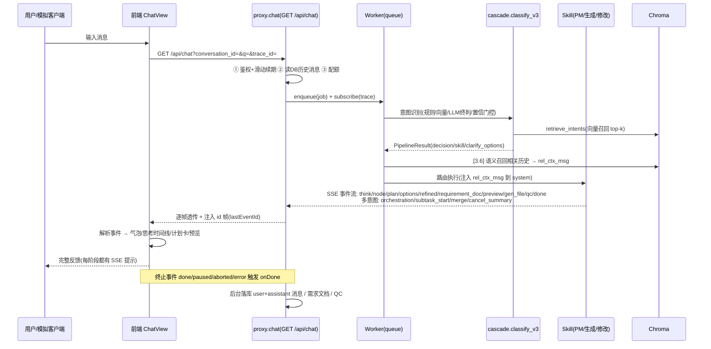

# SeedAI 建站系统流程示意图与架构说明

> 本文档配合「12 轮浏览器标准模拟测试报告」使用，用示意图说明系统端到端流程，
> 重点标注 **3 种中断断点续传**、**跨轮 DST 持久化**、**向量库 RAG 注入** 三处关键设计，
> 并映射到用户提出的 5 大观察点。
>
> 代码依据（已逐行核对）：`backend/app/proxy.py`、`backend/app/agent/core/queue.py`、
> `backend/app/agent/intent/cascade.py`、`backend/app/agent/intent/store.py`、
> `backend/app/agent/skills/agent_requirement.py`。

---

## 1. 全局架构（单进程 v2.0）

```mermaid
flowchart LR
    U[浏览器 / 模拟客户端<br/>Vue3 + SSE(EventSource)] -.HTTP :7100.-> F[前端静态站点]
    U -.SSE /api/chat :7101.-> B[后端单进程 uvicorn :7101]
    B --> Q[同进程队列 Worker<br/>concurrency=2]
    Q --> SK[Skill 执行层<br/>PM / 生成站 / 修改 / 删除 / 文档 / 闲聊]
    Q --> AG[角色编排 Orchestrator<br/>4 RoleAgent + 强Schema交接]
    B --> DB[(MySQL 运行/冷备份)]
    B --> RD[(Redis 热键/缓存/checkpoint)]
    B --> CH[(Chroma 向量库<br/>components/error_patterns/intents/memory/...)]
    B --> LLM[LLM(qwen / deepseek)<br/>意图终判 + 生成 + QC]
```

- 前端 `:7100` 仅做静态托管 + 反向代理 `/api` → `:7101`（vite proxy）。
- v2.0 起 AI 核心与业务端合并为**单一 FastAPI 进程**，`/api/chat` 直接把 job 投递给同进程队列，不再走 httpx 转发（根治 R1/R2/R3 双转发问题）。
- 鉴权：登录后 `access_token` 写入 HttpOnly Cookie；SSE 端点同时支持 `?token=` 查询参数（非浏览器客户端/测试 harness 用）。

---

## 2. 端到端一次对话流程（一发一收）

浏览器标准交互：**发一条 → 等 SSE 完整回复(直到终止事件) → 读回复 → 随机选系统推荐项 → 再发下一条**。



**关键事件协议（SSE）**：`think`(临时思考面板, 含 `stage=rag` 向量召回提示) / `node`(阶段完成) / `plan`(执行计划卡) /
`options`(结构化候选, 含 recommended 标记) / `clarify_questions`(自然语言追问) /
`refined`(正式落库回复) / `requirement_doc`(需求文档 JSON) / `preview`(预览直链) /
`gen_file`(生成中文件名) / `qc`(质检) / `token`(增量文本) / `done|paused|aborted|error|unsupported`(终止)。

> **新增观测事件（2026-07-29）**：生成 skill 在调用 `build_rag_context` 后发出
> `think(stage=rag, msg="📚 向量库召回 → 组件库 N / 历史记忆 N / 项目记忆 N / 用户偏好 N / 错误模式 N", hits={...})`，
> 既改善「每阶段系统正在干什么」的友好反馈（观察点 ④），又让向量库是否真正进入 LLM 可被观测验证（观察点 ③）。

---

## 3. 跨轮 DST（意图槽位）持久化

```mermaid
flowchart TD
    A[用户本轮消息] --> B[cascade._classify_segment]
    B --> C{load_slots<br/>conversation_id}
    C -->|Redis 命中| D[读 intent:slots:{cid}]
    C -->|Redis miss| E[回源 MySQL intent_slots 表<br/>user+project+conv 三元定位]
    E -->|命中| F[回填 Redis 并返回]
    D --> G[LLM 终判 + 槽位累积]
    E -->|miss| G
    G --> H[save_slots: 写 Redis + 异步落 MySQL]
    H --> I[下游 LLM 读回 slots 作为『已收集信息』<br/>避免重复追问]
    Note1[切会话天然隔离: 每行=一个会话(三元联合唯一键)]
    Note2[user_id/project_id 为 None 时退化为纯 Redis, 不阻塞主流程]
```

- **热键** `intent:slots:{conversation_id}`（Redis，零延迟）；**冷备份** `intent_slots` 表（MySQL，每行一个会话，三元联合唯一键 `uq_intent_slots_ucp`）。
- Redis 丢失时 `load` 自动从 MySQL 回源并回填；`save` 双写；`reset` 双清（仅当前会话一行）。
- 不同项目/不同会话互不串态（观察点 2 的核心保障）。

---

## 4. 三种中断 · 断点续传

```mermaid
flowchart TD
    subgraph S1[① 手动点击停止]
        A1[用户点「停止」] --> B1[POST /api/cancel {trace_id}]
        B1 --> C1[proxy 置 cancel:{tid}<br/>Worker 收到后中止]
        C1 --> D1[#447 保证任意终态都落一条反馈 message<br/>success/fail/中断]
        D1 --> E1[用户可重新发起对话继续]
    end
    subgraph S2[② F5 刷新]
        A2[浏览器刷新] --> B2[旧 SSE 连接断开<br/>_on_disconnect: 仅 SREM clients:{tid}<br/>不暂停 Worker]
        B2 --> C2[Worker 继续跑完, 事件入 Redis 流]
        C2 --> D2[前端用本地记录的 after 游标<br/>重订阅 GET /api/chat?after={id}]
        D2 --> E2[回放已产生事件 + 续实时增量<br/>inject id 帧(lastEventId) 支撑精确续接]
    end
    subgraph S3[③ 离线 5 分钟 / 服务重启]
        A3[网络断开或服务被杀] --> B3[断连不暂停, Worker 继续]
        B3 --> C3[重连: GET /api/chat?after={id}&resume=true]
        C3 --> D3[proxy 读 checkpoint(Redis 优先, MySQL 兜底)<br/>注入 checkpoint_data + resume_mode]
        D3 --> E3[进程启动 reconcile_orphaned_runs:<br/>孤儿 running Trace → paused(有ck)/aborted(无ck)]
        E3 --> F3[前端 my-info 进入「继续」横幅<br/>从中断处恢复]
    end
```

| 中断类型 | 触发方式 | 续传机制 | 终止落库保障 |
|---|---|---|---|
| 手动停止 | `POST /api/cancel` | Worker 中止，不续跑 | `#447` 任意终态落反馈 message |
| F5 刷新 | 断 SSE + `after` 游标重订阅 | Redis 流回放 + 实时增量 | 纯断连不落库，交由 Worker 兜底落库 |
| 离线/重启 | `after`+`resume=true`，或重启后 reconcile | checkpoint(Redis/MySQL) 注入 + my-info 横幅 | `reconcile_orphaned_runs` 补「可续」反馈 |

---

## 5. 向量库对 LLM 的真实作用（RAG 注入）

向量库通过**两条通道**对 LLM 产生真实作用：

**(A) 跨轮语义历史召回**（`[3.6]` 本会话消息集合）

```mermaid
flowchart LR
    M[本轮用户消息] --> Q[worker: find_relevant_message_contents<br/>Chroma 语义召回本会话相关历史 top-6]
    Q --> R[构造 rel_ctx_msg<br/>role=system, 内容为『相关历史对话片段』]
    R --> P1[多意图路径: orch_messages.insert(0, rel_ctx_msg)]
    R --> P2[单意图路径: _enriched_messages.insert(0, rel_ctx_msg)]
    P1 --> LLM[LLM 看到跨轮语义历史]
    P2 --> LLM
```

**(B) 跨会话个性化/规则召回**（`build_rag_context` → 组件库/记忆/偏好/错误模式）

```mermaid
flowchart LR
    G[生成 skill: build_rag_context(query, project_id, user_id)] --> C1[components 组件库(全局)]
    G --> C2[memory 历史记忆(按 project_id 隔离)]
    G --> C3[project_memory 项目记忆(按 project_id 隔离)]
    G --> C4[user_preferences 用户偏好(按 user_id 隔离)]
    G --> C5[error_patterns 错误经验(全局)]
    C1 & C2 & C3 & C4 & C5 --> CT[拼接为参考上下文 text + hits 命中数]
    CT --> EV[emit think(stage=rag, hits) 观测事件]
    CT --> PL[注入 Planner 的 user 消息 → LLM 真正读到向量内容]
```

- `[3.6]` 在 `queue.py` 注入；**两条执行路径都注入**（多意图编排 `core/queue.py:1104`、单意图角色 `core/queue.py:1262`）。
- `build_rag_context` 返回 `{text, hits}`，其中 `hits` 记录各集合命中条数；生成 skill 据此发出 `think(stage=rag)` 事件（观察点 ③ 的可观测证据）。
- 个人偏好（`user_preferences`）、项目记忆（`project_memory`）、错误经验（`error_patterns`）经此通道进入 system，使生成贴合用户历史（观察点 3）。
- 偏好/记忆的写入发生在建站 `done` 后的 L2 蒸馏（`upsert_user_preference` / `upsert_project_memory`），因此**第 2 个及之后的项目/轮次**才能检索命中（首轮仅组件库/错误模式命中）。

---

## 5½. 多意图拆分与编排执行（任务拆分准确 + 子任务可靠执行）

当用户**单条消息含多个独立可交付目标**（如「建站 + 闲聊 + 设计」「修改 + 设计 + 修改 + 新建」），
系统走多意图编排路径，将一条请求准确拆为多个子任务并可靠执行：

```mermaid
flowchart TD
    U[用户单条多意图消息] --> G[轻量门控 _lightweight_multi_check<br/>强触发连词(并且/另外/同时/再帮我/还要/以及) 或 ≥2 意图大类]
    G -- 单意图 --> S[单 skill 直路由]
    G -- 多意图 --> B[方案B split_hybrid<br/>切段 → 复用 _classify_segment 逐段分类<br/>→ 合并相邻同意图段 → 依赖链接]
    B -- 有效≥2 且 平均置信≥阈值 --> OK[采用方案B source=hybrid]
    B -- 未识别≥2 / 置信过低 --> A[方案A split_by_llm<br/>JSON Schema 校验 + 自愈修复环兜底]
    OK --> OR[Orchestrator.build_layers 分层<br/>有依赖→mixed(分层串行+层内并行)<br/>无依赖→parallel(全并行)]
    A --> OR
    OR --> O1[emit orchestration 事件<br/>total / strategy / tasks(子任务清单: id,goal,skill,risk,deps)]
    O1 --> L1[层#1 并行: emit subtask_start ×N → 各 skill 执行]
    L1 --> L2[层#2(若有依赖) ...]
    L2 --> MG[emit merge 事件<br/>success_count / fail_count / failed_tasks / 合并文本]
    MG --> DN[emit done 收口(编排器统一收口, 非单 skill)]
```

- **门控零 LLM 开销**：强触发连词直接短路进入混合分层，避免漏召（OPTIMIZE_PLAN §2）。
- **方案 B 默认快路径**：确定性切段 + 逐段复用单意图分类器（不含拆分步骤，无递归），可解释、零新增分类逻辑。
- **升级判定**：方案 B 未识别出 ≥2 有效子任务或平均置信 < `split_escalate_low_conf`(0.6)，升级方案 A（LLM 深拆）兜底。
- **上限保护**：`split_b_max_subtasks=6`，超长请求截断并提示「建议分步对话」。
- **子任务可靠执行**：`orchestrator.py` 用 DAG 分层（`build_layers`）调度，`subtask_start` 逐子任务实时反馈，`merge` 汇报成功/失败清单，`done` 统一收口；层间/层内并行并发归并，前端实时看到各子任务进度。
- **可观测事件**：`orchestration`(拆分总览) / `subtask_start`(子任务开始) / `merge`(执行汇总) / `cancel_summary`(取消时已完成/已跳过清单)。
- 关键代码：`intent/multi_intent.py`（`recognize_intents` / `split_hybrid` / `split_by_llm`）、`core/orchestrator.py`（`run_multi` / `build_layers` / `merge`）。

> **实测补充（2026-07-29 多意图 3 条专项，详见 TEST_REPORT_12.md §2）**：
> - **风险确认门控**：子任务 `risk=medium`（如"重新设计导航栏""改字体大小"）不会盲目自动应用，编排器将其置为 `skipped`（状态转移 `running→skipped` 合法）进入"中风险待确认"——待用户确认后再执行。这是**设计内的安全防护**，不是执行失败；`merge` 如实给出 `partial_delivery=True` 与完整汇总，`done` 正常收口。
> - **家族归一**：事实查询类意图（天气/知识问答/行业影响）被归为 `agent_search`（信息检索），文档家族词汇中并入 `chat` 家族（与"闲聊/问答"语义一致）；站点修改归 `agent_build`、新建页面归 `agent_generate_site`。拆分**数量与并行/分层结构**为准，家族为引擎更精细的意图识别结果。
> - **慢模型超时保护**：多意图分类经 `_lightweight_multi_check` 门控，疑似多意图给 180s 预算（否则 35s），避免 qwen 慢模型（实测 ~45–50s）单轮分类被掐断降级。

---

## 6. 五大观察点 → 代码映射

| 观察点 | 对应机制 | 关键代码 |
|---|---|---|
| ① 流程完整 + 3 中断续传 | 终止事件 + cancel + after 游标 + checkpoint + reconcile | `proxy.py` publisher/_on_disconnect/`reconcile_orphaned_runs`；`#447` |
| ② 按流程走 + DST 精准带到每次对话 | 三元联合键隔离 + load/save/reset | `intent/store.py`、`intent/cascade.py` |
| ③ 向量库真实作用 | `[3.6]` rel_ctx_msg 双路径注入 + `build_rag_context`(组件库/记忆/偏好/错误模式) + rag think 观测事件 | `core/queue.py:927/1104/1262`、`knowledge/chroma.py:build_rag_context`、`agent_generate_site.py`/`agent_build.py` rag think |
| ④ 反馈体验友好（每阶段 SSE） | think/node/plan/options/refined 全事件（+多意图 orchestration/subtask_start/merge） | `agent_requirement.py`、`proxy.py` SSE 透传、`core/orchestrator.py` |
| ⑤ 统计系统收集 | analytics 全维度埋点 + 后台统计面板 | `agent/analytics.py`、`admin` 三维度统计 |
| ⑥ 多意图拆分准确 + 子任务可靠执行（本次新增验证） | 轻量门控 → 方案B/方案A 拆分 → Orchestrator 分层调度 → orchestration/subtask_start/merge 事件 | `intent/multi_intent.py`、`core/orchestrator.py` |

---

## 7. 测试账号（供登录复查）

- 模拟账号：`sim12_user` / `testpass123`（harness 自动注册，固定可复现）
- 超管（重置脚本创建）：`huzhen` / `huzhen189`
- 后端地址：`http://localhost:7101`；前端：`http://localhost:7100`

---

*文档生成：Senior Developer（高级开发工程师）。基于 2026-07-29 代码核对。*
